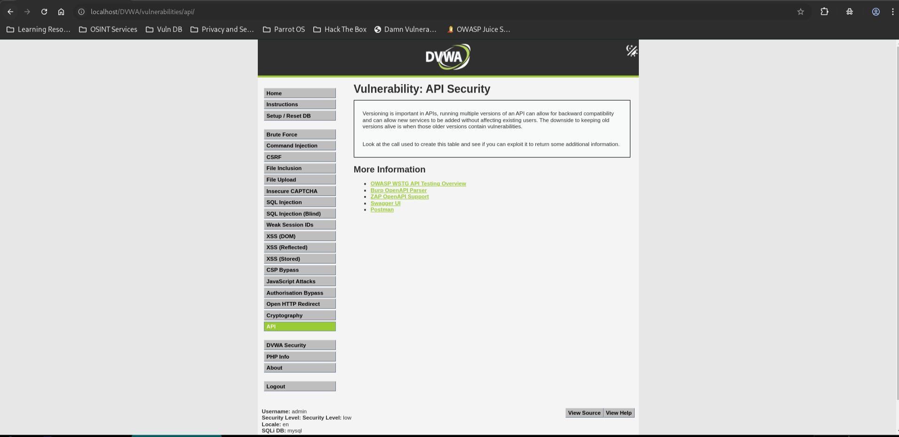
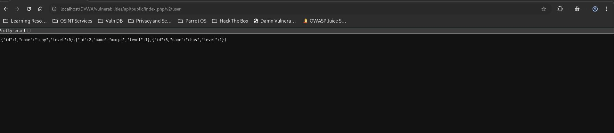
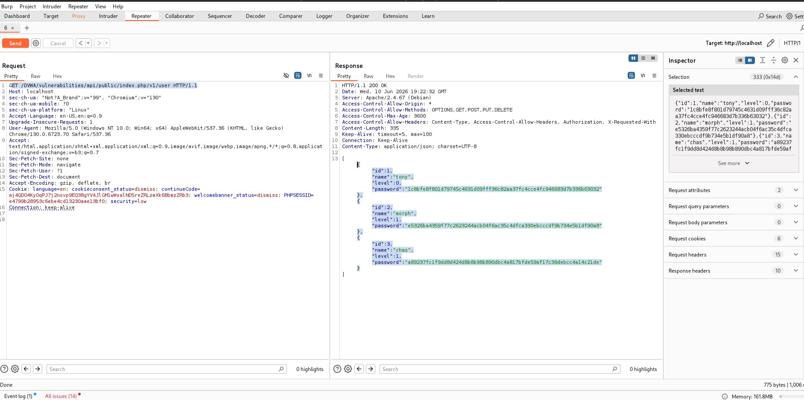

# API Security - Low

## Steps

### 1. Open the API Security Module
- Set DVWA Security Level to **Low**.
- Navigate to **API Security**.



---

### 2. Access the Current API Version
- Browse to:
  ```
  /DVWA/vulnerabilities/api/public/index.php/v2/user
  ```
- Observe that only user information is returned.



---

### 3. Access the Legacy API Version
- Intercept the request in **Burp Suite Repeater**.
- Change:
  ```
  /v2/user
  ```
  to:
  ```
  /v1/user
  ```
- Send the modified request.



---

## Result

The legacy API version exposed additional sensitive data:

```json
{
  "id": 1,
  "name": "tony",
  "level": 0,
  "password": "1c8bfe8f801d79745c4631d09fff36c82aa37fc4cce4fc946683d7b336b63032"
}
```

Password hashes were disclosed for all users through the deprecated API endpoint.

---

## Reason

The application maintains multiple API versions. While the newer API (`v2`) hides sensitive fields, the older API (`v1`) still exposes password hashes. An attacker can directly access the deprecated endpoint and retrieve information that should no longer be available.

---

## Fix

- Remove deprecated API versions.
- Enforce authentication and authorization on all API versions.
- Review legacy endpoints before deployment.
- Apply consistent security controls across versions.
- Return only necessary data fields to clients.
