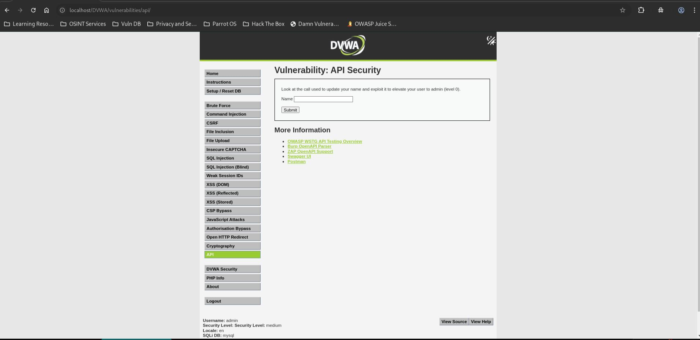
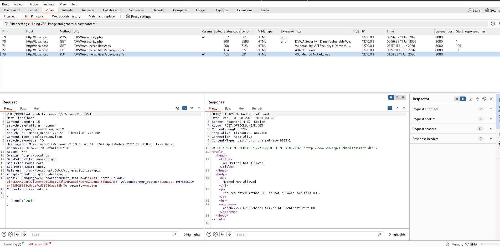
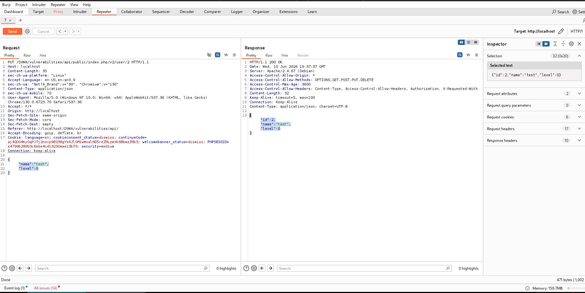

# API Security - Medium

## Steps

### 1. Open the API Security Module

* Set DVWA Security Level to **Medium**.
* Navigate to **API Security**.



---

### 2. Capture the API Request

* Enter a test value in the **Name** field.
* Click **Submit**.
* Intercept the request in **Burp Suite**.
* Observe the API request:

```http
PUT /DVWA/vulnerabilities/api/v2/user/2
```



---

### 3. Modify User Privileges

* Send the request to **Burp Repeater**.
* Modify the JSON body:

```json
{
  "name":"test",
  "level":0
}
```

* Send the modified request.



---

## Result

The API accepted the modified request and updated the user's privilege level:

```json
{
  "id": 2,
  "name": "test",
  "level": 0
}
```

The user account was successfully changed from a normal user (`level: 1`) to an administrator (`level: 0`).

---

## Reason

The API trusts client-supplied parameters and does not properly validate or restrict modification of sensitive attributes. An attacker can directly modify the JSON request and elevate privileges by changing the `level` parameter.

---

## Fix

* Enforce server-side authorization checks.
* Prevent clients from modifying sensitive fields such as roles and privilege levels.
* Implement role-based access control (RBAC).
* Validate all API requests on the server.
* Restrict updates to administrative attributes to authorized users only.
