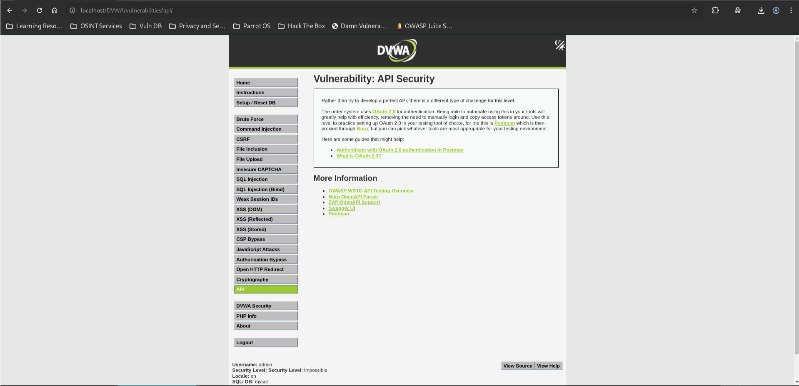

# API Security - Impossible

## Steps

### 1. Open the API Security Module

* Set DVWA Security Level to **Impossible**.
* Navigate to **API Security**.

---

### 2. Review Authentication Requirements

* Observe that the application uses **OAuth 2.0** for API authentication.
* Review the provided guidance for configuring OAuth 2.0 in API testing tools such as Postman and Burp Suite.

---

## Result

No exploitable vulnerability was identified.

The application requires authenticated API access through OAuth 2.0 and focuses on secure authentication practices rather than exposing vulnerable endpoints.

---

## Reason

The Impossible level mitigates the weaknesses demonstrated in previous levels by enforcing stronger authentication controls and requiring valid OAuth 2.0 authorization before accessing protected API functionality.

---

## Fix

* Continue using OAuth 2.0 or similar industry-standard authentication mechanisms.
* Enforce token validation on all protected API endpoints.
* Apply proper authorization checks after authentication.
* Use short-lived access tokens and secure token handling practices.
* Regularly review and rotate authentication credentials.
