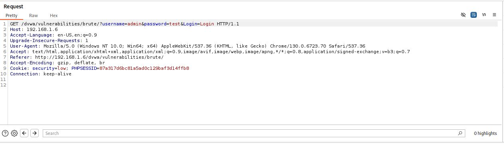
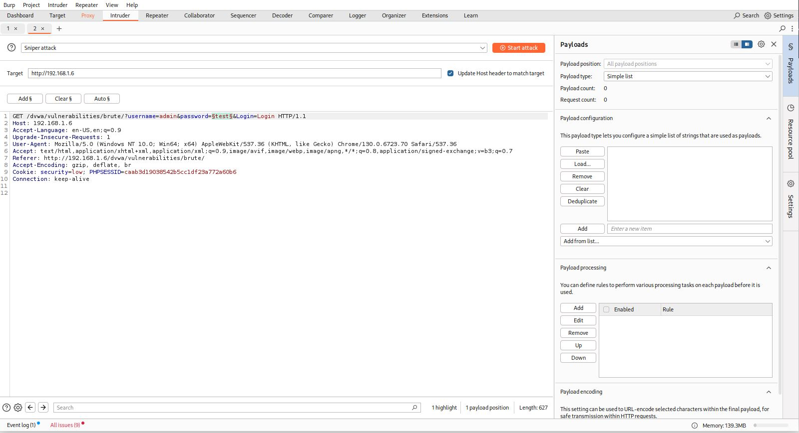
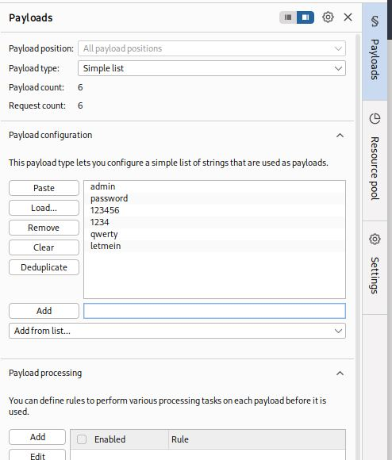
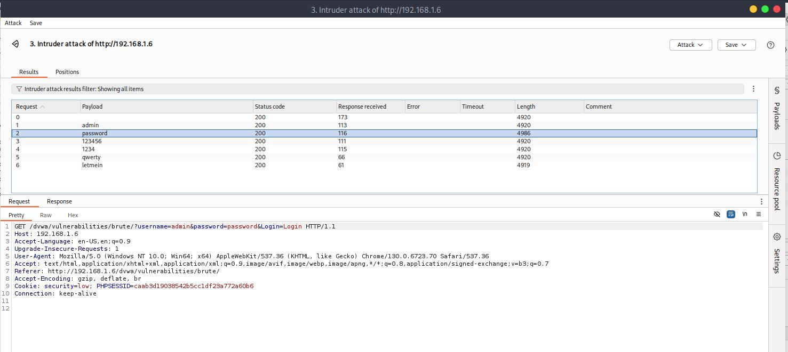

# Brute Force - Low

## Step 1
Captured the login request from the DVWA Brute Force page using Burp Suite.

## Step 2
Sent the request to Burp Intruder and selected the password parameter as the attack position.

## Step 3
Loaded a common password wordlist containing values such as:
- admin
- password
- 123456

## Step 4
Executed the attack and monitored response lengths to identify anomalies.

## Result
Successfully identified valid credentials:

- Username: admin
- Password: password

## Reason
The application does not implement any brute-force protection, allowing unlimited login attempts and exposing response differences that reveal successful authentication.

## Fix
- Implement rate limiting.
- Enforce account lockout after multiple failed attempts.
- Add CAPTCHA protection.
- Monitor and log suspicious login activity.