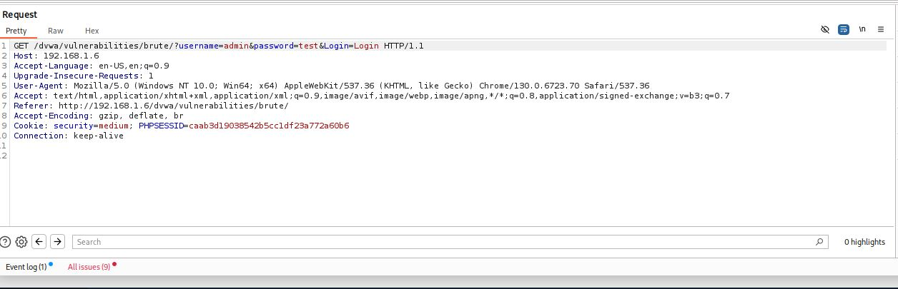
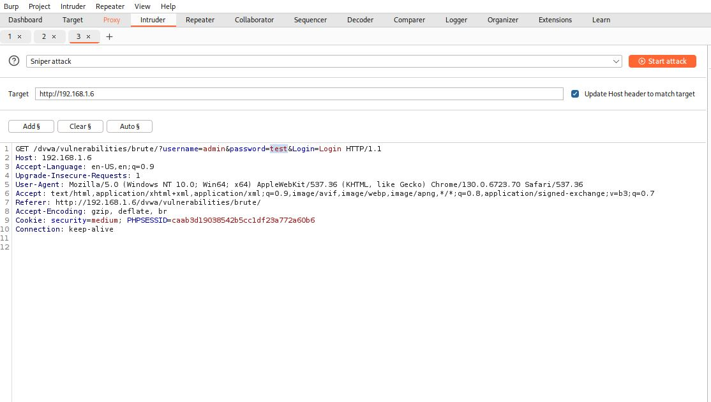
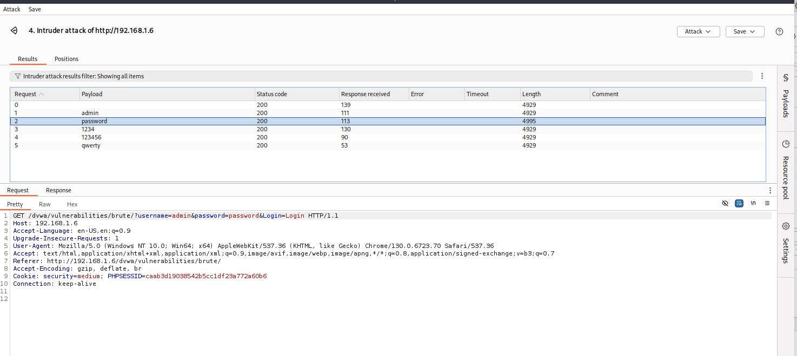

# Brute Force - Medium

## Step 1
Captured the login request from the DVWA Brute Force page at Medium security level.

## Step 2
Sent the request to Burp Intruder and targeted the password parameter.

## Step 3
Configured a common password wordlist as payloads.

## Step 4
Executed the attack and analyzed the responses.

## Result
Successfully identified the valid password through brute-force testing.

## Reason
The implemented protections were weak and could be bypassed using automated requests.

## Fix
- Apply stronger rate limiting.
- Implement account lockout policies.
- Add CAPTCHA verification.
- Monitor repeated failed login attempts.