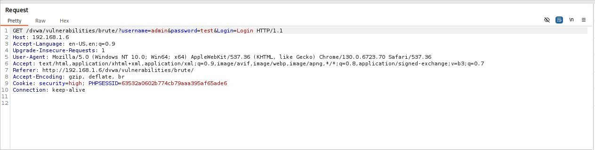
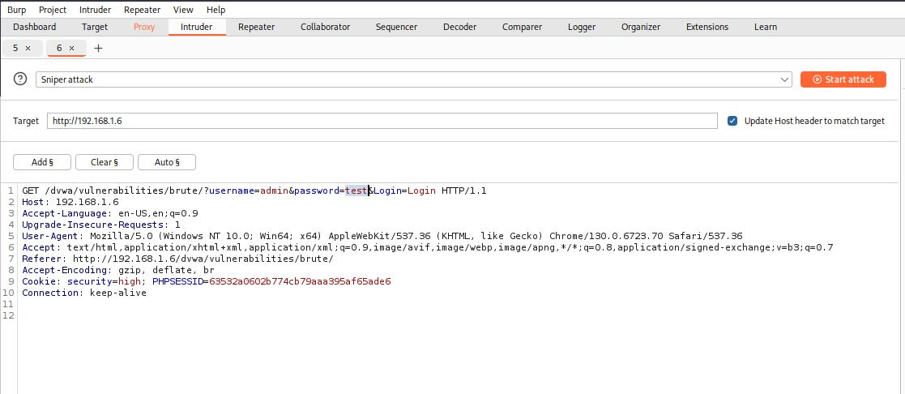
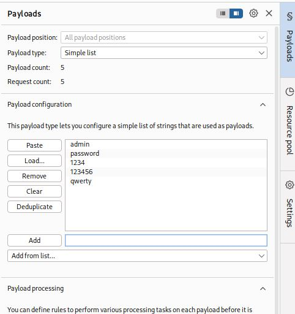
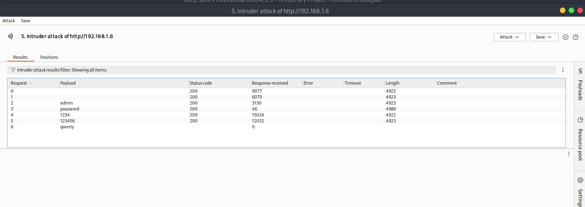

# Brute Force - High

## Step 1
Captured the login request from the DVWA Brute Force page using Burp Suite.

## Step 2
Sent the request to Burp Intruder and configured the password parameter for testing.

## Step 3
Submitted multiple password payloads using Intruder.

## Step 4
Reviewed the responses and observed that they appeared similar.

## Result
Unable to reliably identify the correct password using automated brute-force techniques.

## Reason
The application hides response differences, preventing attackers from easily distinguishing successful and failed login attempts.

## Fix
- Maintain consistent response handling.
- Implement rate limiting.
- Enforce account lockout mechanisms.
- Add CAPTCHA protection.
- Monitor suspicious authentication activity.