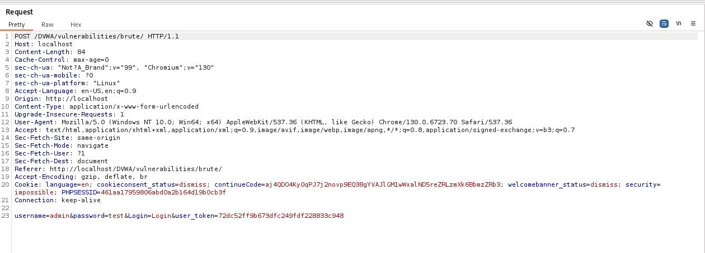
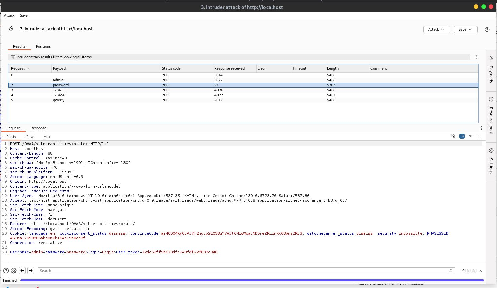

# Brute Force - Impossible

## Step 1
Captured login request using Burp Suite.

## Step 2
Attempted brute force attack using Intruder.

## Step 3
Sent multiple password payloads.

## Step 4
Observed that all responses returned similar status and response lengths.

## Result
Could not successfully perform automated brute force attack.

## Reason
Application implemented stronger authentication and request validation protections.

## Conclusion
Brute force attack becomes ineffective due to improved security mechanisms and lack of identifiable response differences.

## Fix / Protection Used
- Secure session handling
- Request validation
- Strong authentication protection
- Anti-brute-force mechanisms

## Screenshots

