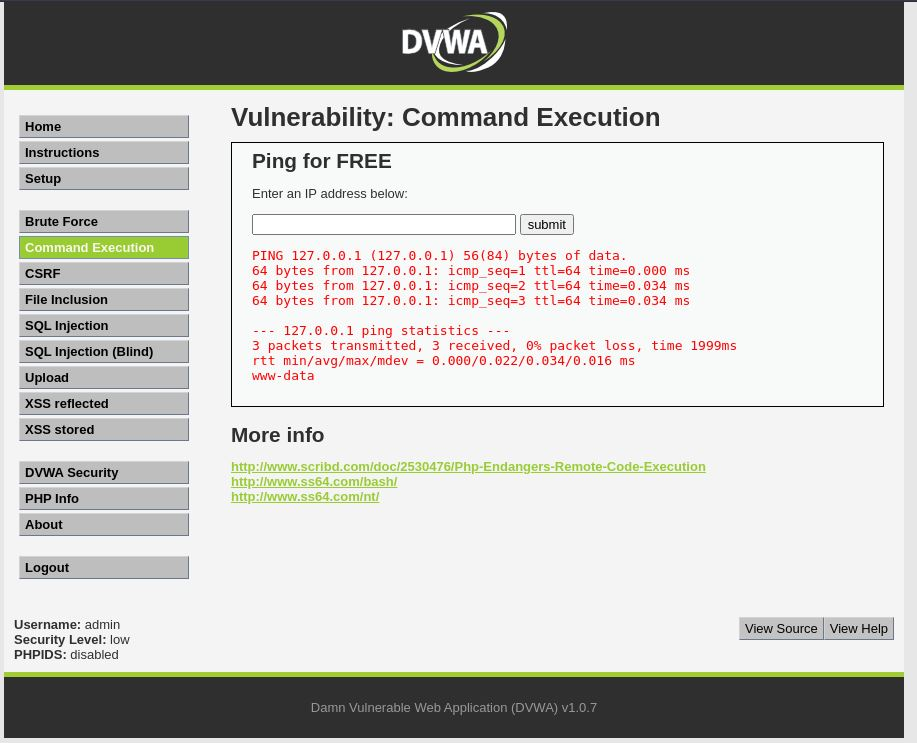

# Command Injection - Low

## Step 1
Tested a valid IP address and observed normal ping output.


## Step 2
Injected the following payload:

```text
127.0.0.1; ls
```


## Step 3
The application executed the additional command and displayed the server directory listing.


## Step 4
Verified command execution by running additional commands such as:

```text
127.0.0.1; whoami
```



## Result
Successfully achieved operating system command execution on the server.

## Reason
User input is directly passed to a system command without proper sanitization or validation, allowing attackers to append arbitrary commands.

## Fix
- Validate and sanitize user input.
- Use strict allowlist validation.
- Avoid direct system command execution.
- Use safer built-in APIs instead of shell commands.