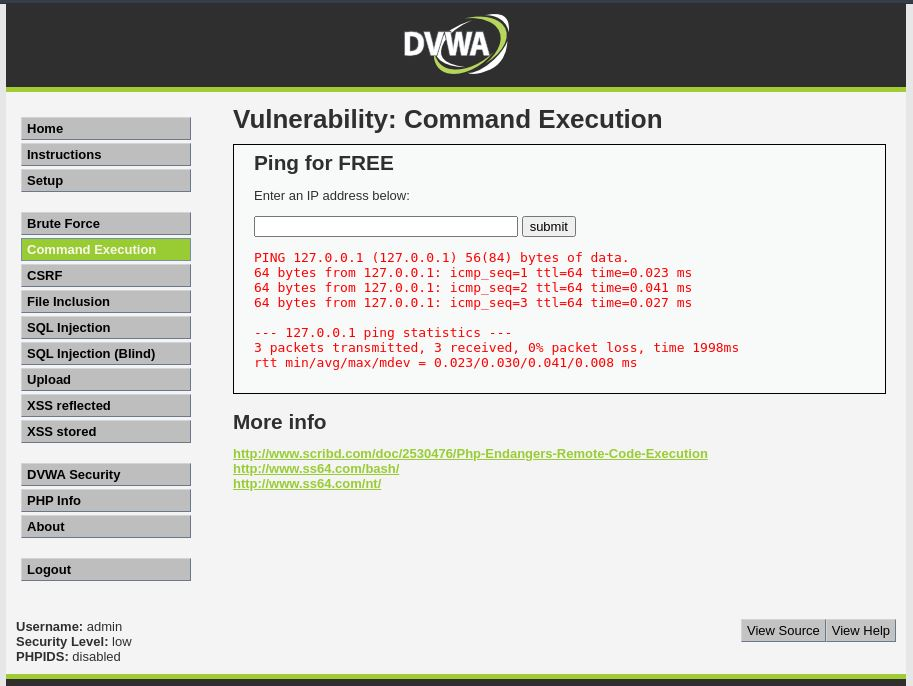
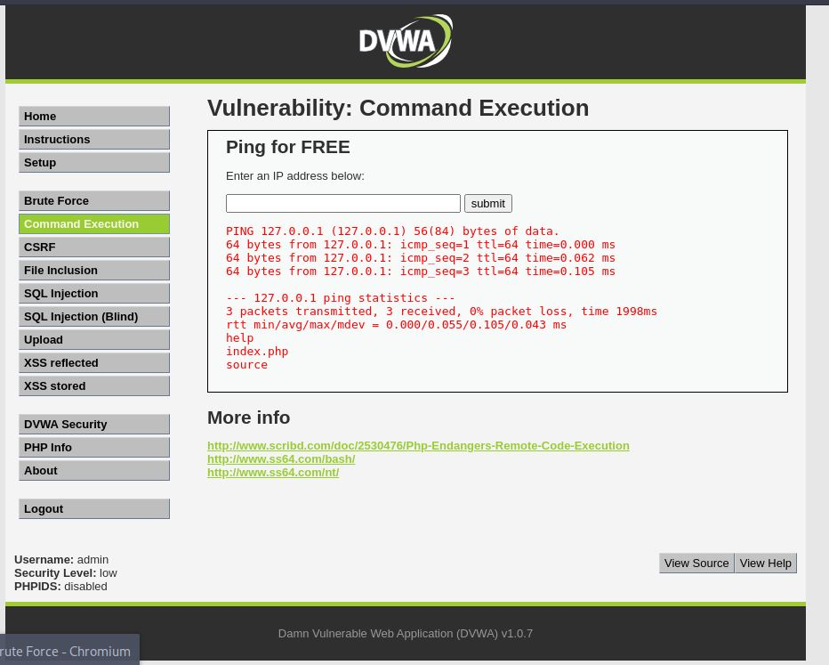
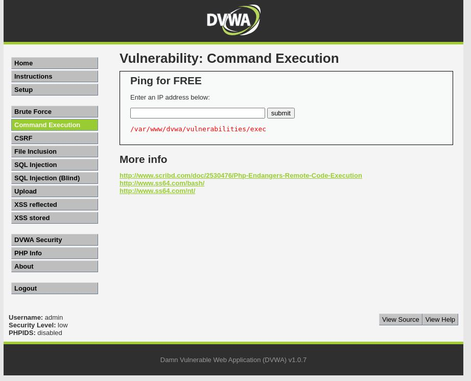

# Command Injection - Low

## Step 1
Tested normal input (127.0.0.1) and observed ping output.

## Step 2
Injected payload: 127.0.0.1; ls

## Step 3
Application executed additional system command.

## Step 4
Verified execution using commands like whoami and pwd.

## Result
Successfully achieved command execution on the server.

## Reason
User input is directly passed to system command without sanitization.

## Fix
- Input validation
- Avoid system command execution
- Use safe APIs

## Screenshots

