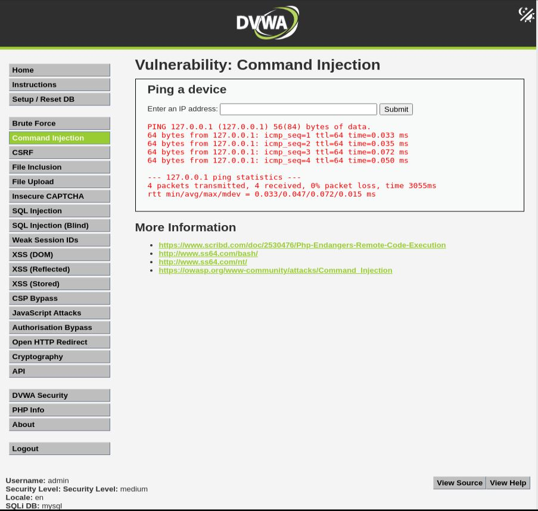
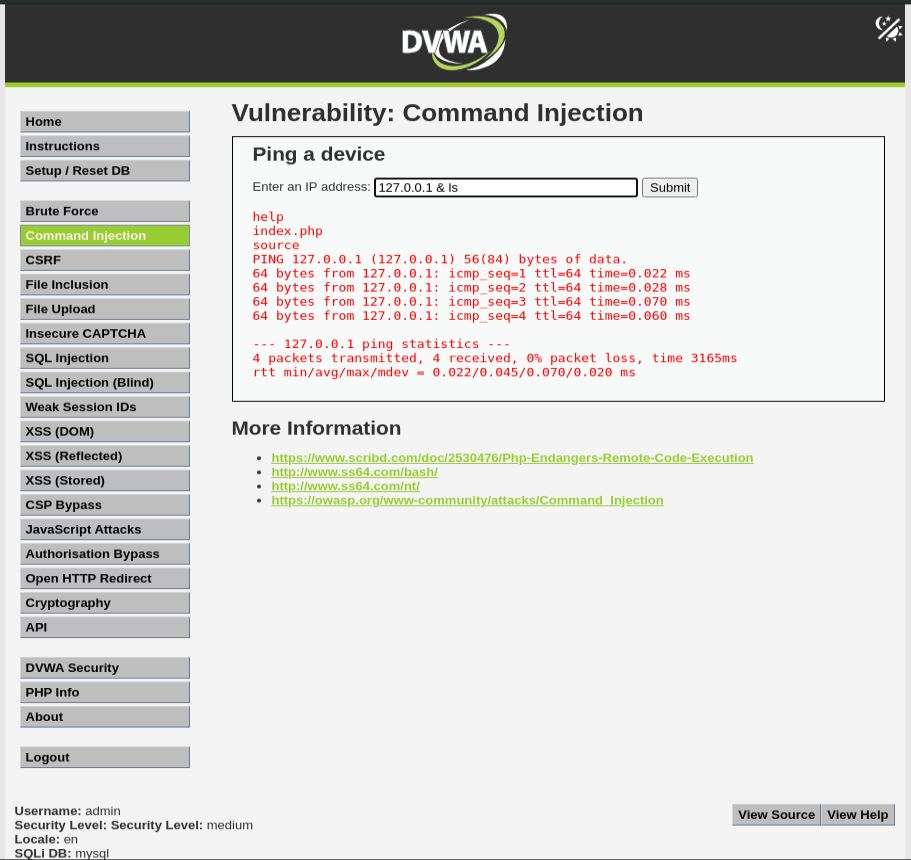

# Command Injection - Medium

## Step 1
Tested the following payload:

```text
127.0.0.1; ls
```



## Step 2
Observed that common command separators such as `;` were blocked by the application.

## Step 3
Attempted a bypass using the following payload:

```text
127.0.0.1 & ls
```



## Step 4
The application executed the additional command, confirming that the filter could be bypassed.

## Result
Command injection remained possible despite the implemented filtering.

## Reason
The application uses incomplete blacklist filtering and fails to block all command separators.

## Fix
- Use strict allowlist validation.
- Avoid blacklist-based filtering.
- Avoid passing user input directly to system commands.
- Use safer APIs whenever possible.