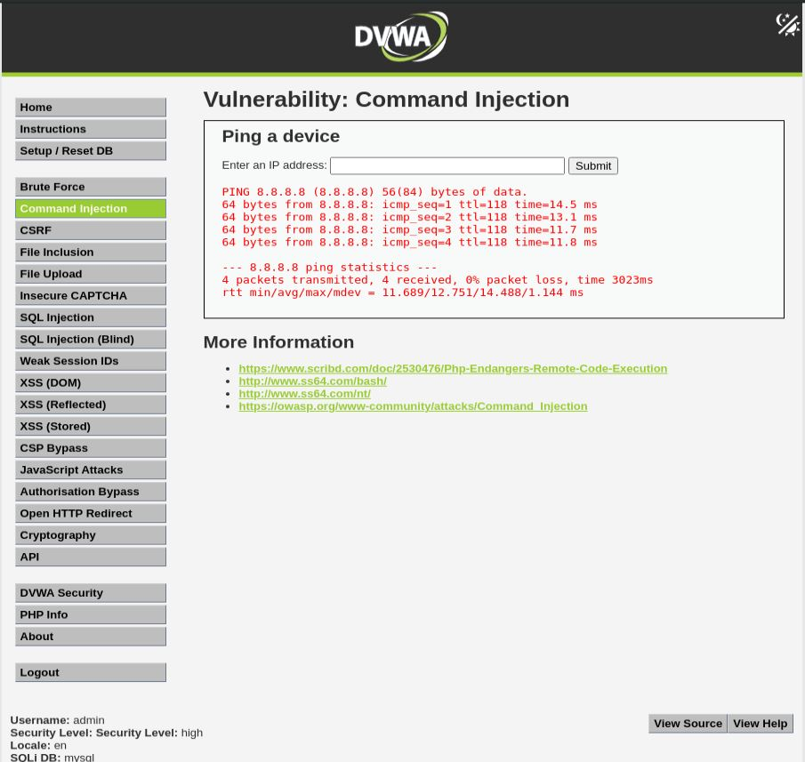
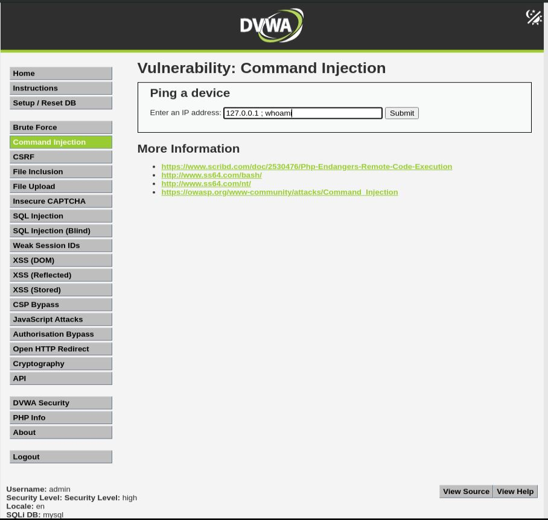
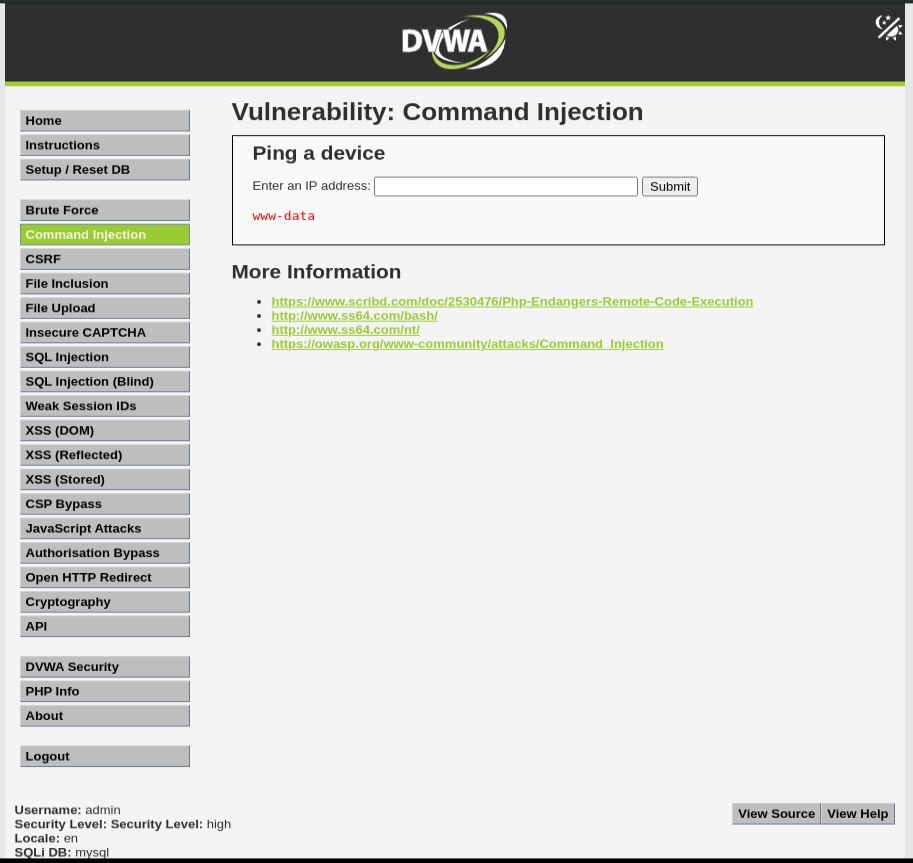

# Command Injection - High

## Step 1
Entered a valid IP address and confirmed normal application behavior.

```text
127.0.0.1
```



## Step 2
Attempted a basic command injection payload.

```text
127.0.0.1;whoami
```



## Step 3
Observed that the application filtered the semicolon character, causing the payload to fail.

## Step 4
Used the following bypass payload:

```text
127.0.0.1|whoami
```



## Result
Successfully achieved command execution using a blacklist bypass technique.

## Reason
The application blocks common command separators such as semicolons but fails to properly filter the pipe operator, allowing command injection.

## Fix
- Implement strict allowlist validation for IP addresses.
- Avoid using shell commands with user-controlled input.
- Replace blacklist filtering with positive validation.
- Run services with minimal privileges.