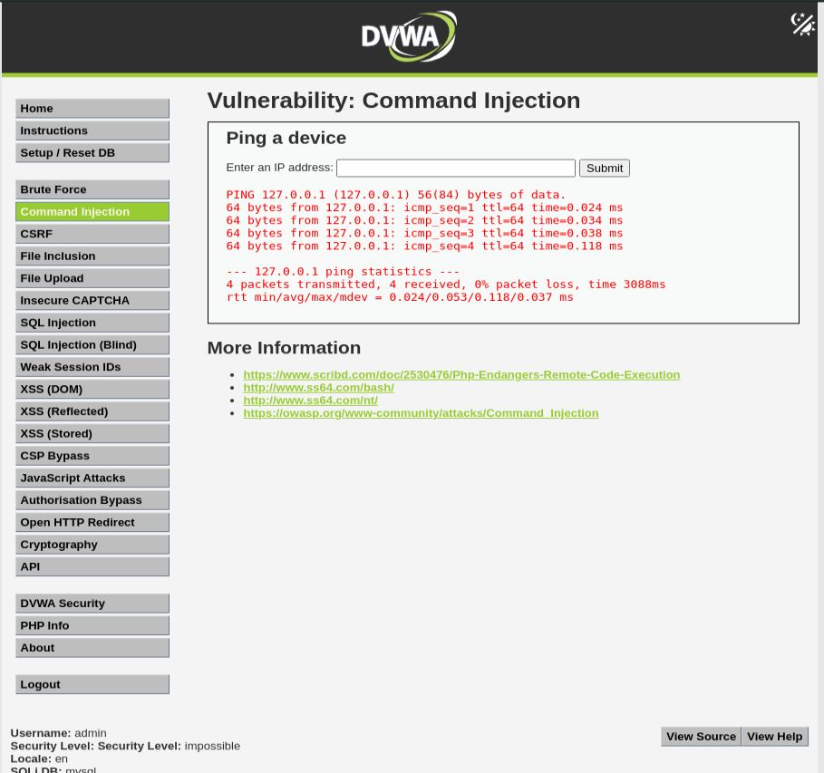
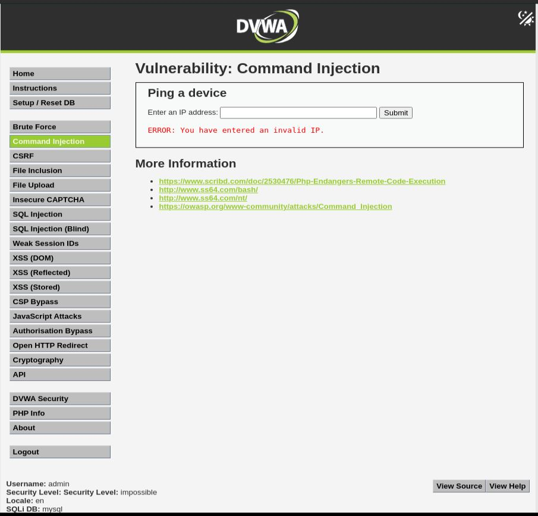
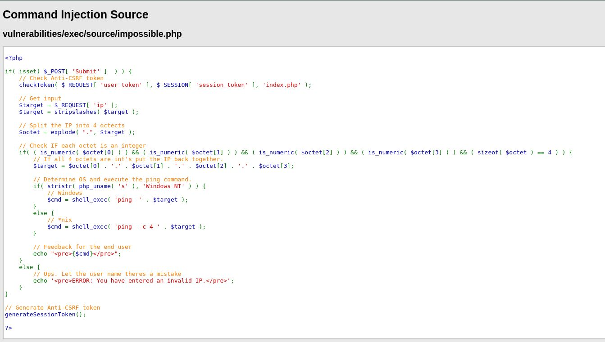

# Command Injection - Impossible

## Step 1
Set the DVWA security level to Impossible.



## Step 2
Entered a valid IP address and confirmed that the ping functionality worked normally.

```text
8.8.8.8
```

## Step 3
Attempted command injection using the following payload:

```text
8.8.8.8 ; ls
```



## Step 4
The application rejected the input and displayed an error indicating that the IP address was invalid.

## Step 5
Reviewed the source code to verify the implemented protections.



## Result
Command injection was not successful.

## Reason
The application performs strict allowlist validation by:
- Splitting the input into four IP octets.
- Verifying each octet is numeric.
- Ensuring exactly four octets exist.
- Rejecting additional characters and command separators.
- Validating Anti-CSRF tokens before processing requests.

## Fix
Already Implemented:
- Strict input validation.
- Allowlist-based IP verification.
- Anti-CSRF protection.
- Rejection of malformed input before command execution.