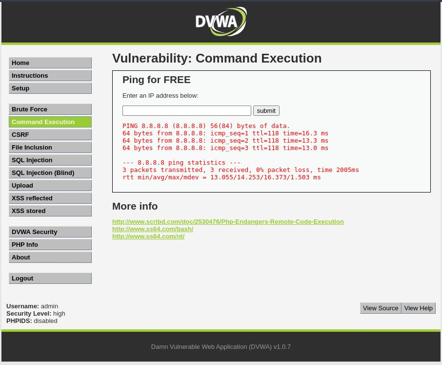
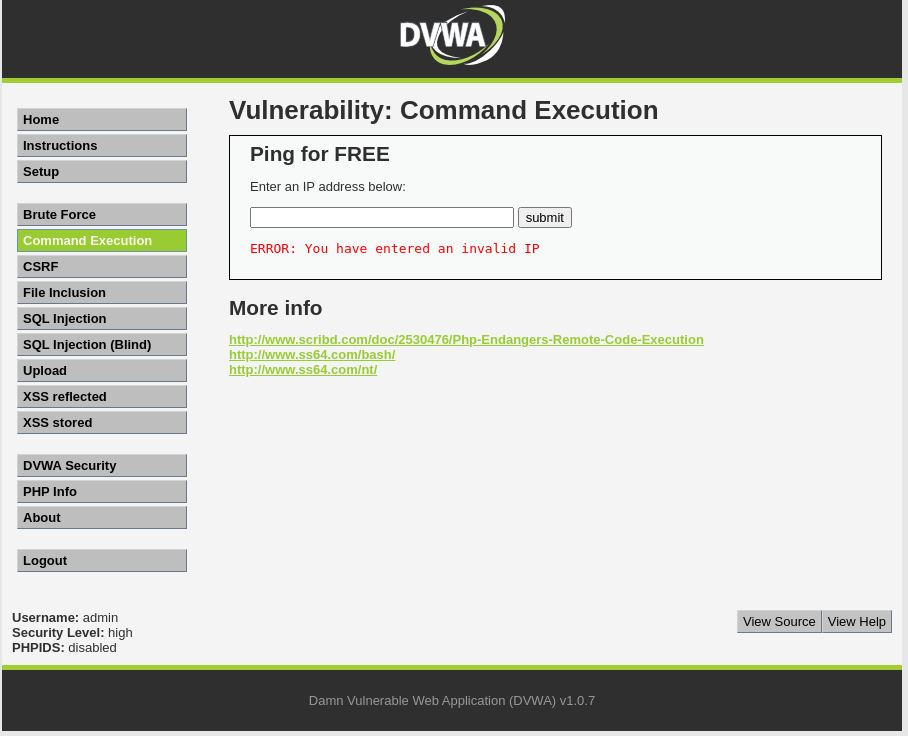

# Command Injection - High

## Step 1
Tested valid input (8.8.8.8) and observed normal ping output.

## Step 2
Attempted command injection using payload: 8.8.8.8 & ls

## Step 3
Application returned error: "Invalid IP"

## Result
Command injection attack was not successful.

## Reason
Application validates input strictly, allowing only numeric IP format.

## Conclusion
Strong input validation prevents command injection.

## Fix
- Use allowlist validation (already implemented)
- Avoid direct system command execution

## Screenshots

