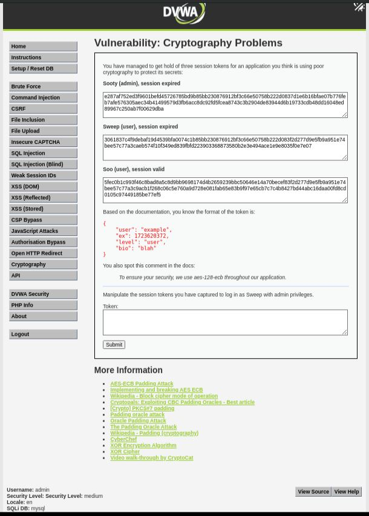
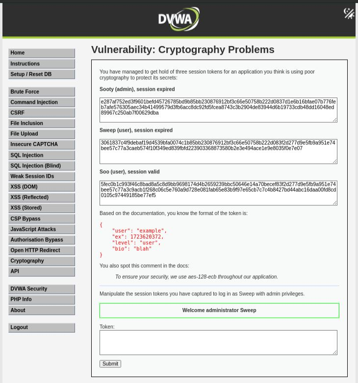

# Cryptography Problems - Medium

## Steps

### 1. Access the Vulnerable Page

* Navigated to **DVWA → Cryptography Problems** with security level set to **Medium**.
* Observed multiple encrypted session tokens.
* Identified that the application uses **AES-128-ECB** mode.



### 2. Analyze the Token Structure

* Reviewed the documented token format:

```json
{
    "user": "example",
    "ex": 1723620372,
    "level": "user",
    "bio": "blah"
}
```

* Noticed that ECB mode encrypts identical plaintext blocks independently.
* Compared the captured tokens and identified reusable ciphertext blocks.

### 3. Perform ECB Block Swapping

* Combined ciphertext blocks from different captured tokens.

* Created a forged token containing:

  * User: `sweep`
  * Level: `admin`

* Submitted the forged token to the application.



## Result

The application accepted the manipulated token and displayed:

```text
Welcome administrator Sweep
```

Administrative access was obtained without knowledge of the encryption key.

## Reason

The application uses:

```text
AES-128-ECB
```

ECB encrypts each block independently and does not provide integrity protection.

Because of this, ciphertext blocks can be copied and rearranged to create new valid tokens with modified privileges.

## Fix

* Do not use ECB mode for session tokens.
* Use authenticated encryption such as AES-GCM.
* Add integrity protection using a MAC or digital signature.
* Validate token authenticity before trusting decrypted data.
