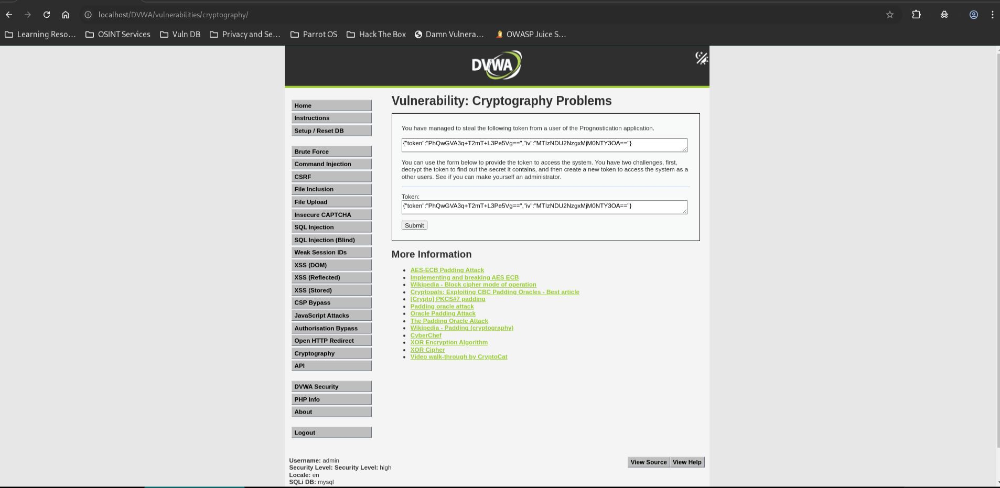
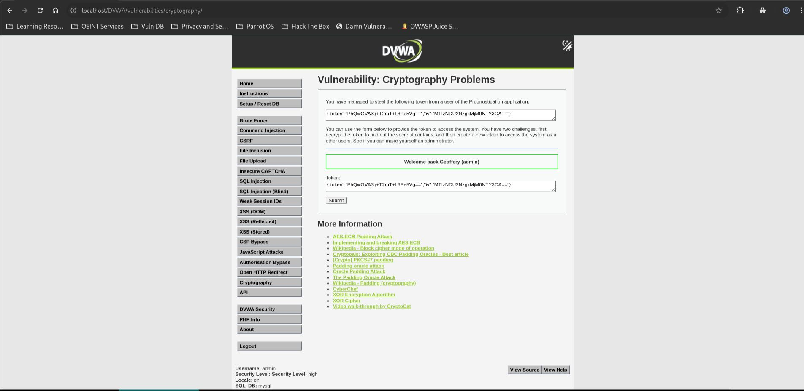

# Cryptography Problems - High

## Steps

### 1. Access the Vulnerable Page

* Navigated to **DVWA → Cryptography Problems** with security level set to **High**.
* Obtained a user token and IV.



### 2. Intercept the Token Validation Request

* Used Burp Suite to intercept the request sent to:

```http
POST /DVWA/vulnerabilities/cryptography/source/check_token_high.php
```

* Observed the JSON token structure:

```json
{
  "token":"PhQwGVA3q+T2mT+L3Pe5Vg==",
  "iv":"MTIzNDU2NzgxMjM0NTY3OA=="
}
```

### 3. Perform CBC IV Bit-Flipping

* Kept the encrypted token unchanged.
* Modified only the IV value:

```json
{
  "token":"PhQwGVA3q+T2mT+L3Pe5Vg==",
  "iv":"MTIzNDU2NzsxMjM0NTY3OA=="
}
```

* Forwarded the modified request.



## Result

The application accepted the modified token and returned:

```text
Welcome back Geoffery (admin)
```

Administrative privileges were obtained without knowledge of the encryption key.

## Reason

The application uses:

```text
AES-128-CBC
```

while allowing the IV to be supplied by the client.

In CBC mode, modifying the IV changes the decrypted plaintext of the first block. By flipping specific bits in the IV, the decrypted value was changed from:

```text
userid:2
```

to:

```text
userid:1
```

which corresponds to the administrator account.

## Fix

* Never allow users to control the IV for authenticated data.
* Use authenticated encryption such as AES-GCM.
* Add integrity protection using an HMAC or digital signature.
* Validate token authenticity before processing decrypted content.
