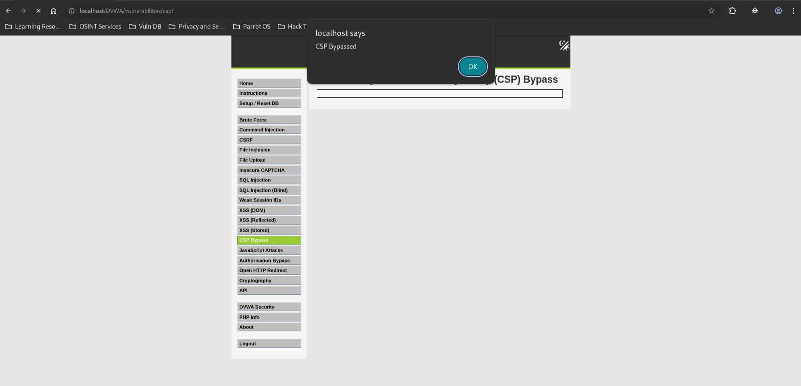

# DVWA CSP Bypass — Low

## Steps

- Opened DVWA CSP Bypass with security level set to **Low**.  
  Screenshot: `01_target_low.jpg`

- Entered the allowed external script URL:

  `https://cdn.jsdelivr.net/gh/digininja/csp_bypass/alert.js`

- Clicked **Include** and the script executed successfully.  
  

## Result

The CSP bypass was successful. An external JavaScript file executed from an allowed domain.

## Reason

The page allows scripts from trusted domains such as:

`cdn.jsdelivr.net`

User input is directly inserted into a script tag:

```html
<script src="USER_INPUT"></script>