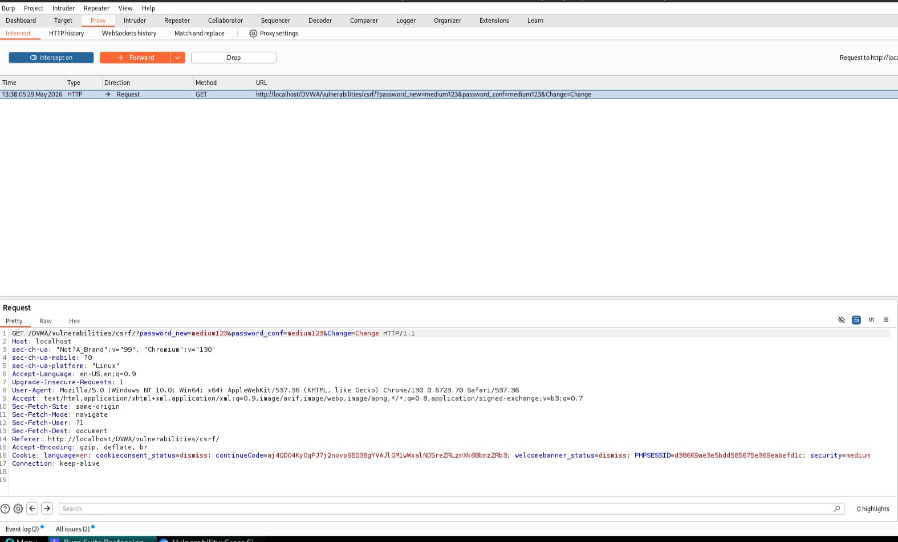
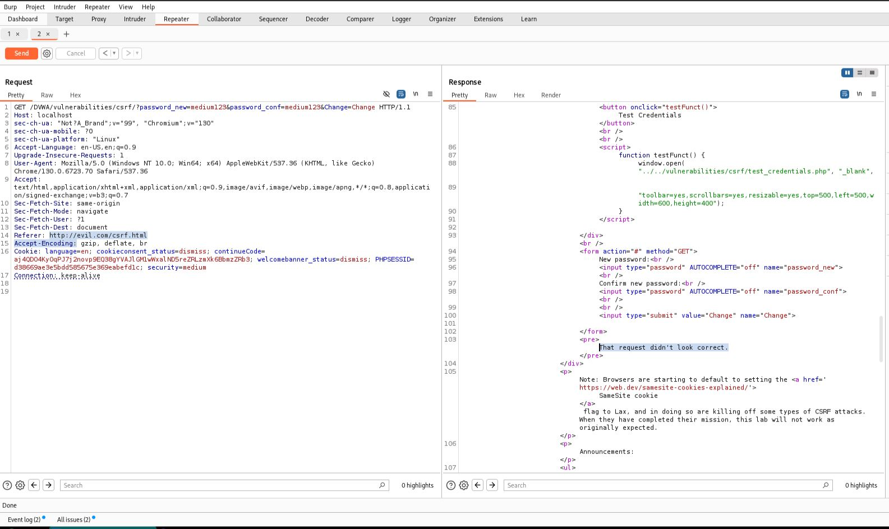
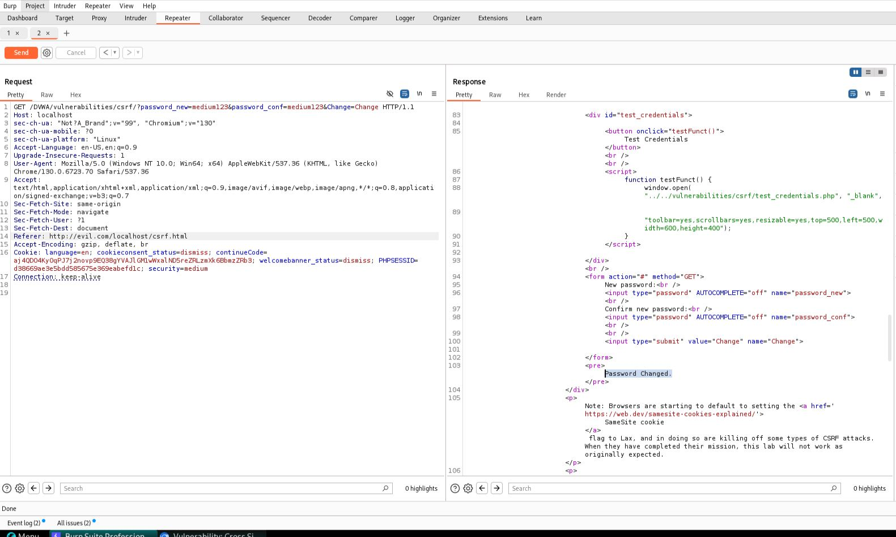

# CSRF - Medium

## Step 1
Captured the password change request using Burp Suite.


## Step 2
Verified that the request was accepted when using a valid Referer header.



## Step 3
Modified the Referer header to:

```text
http://evil.com/csrf.html
```

The request was rejected.



## Step 4
Modified the Referer header to:

```text
http://evil.com/localhost/csrf.html
```

The request was accepted and the password was changed successfully.



## Result
Successfully bypassed the Medium-level CSRF protection.

## Reason
The application only checks whether the server hostname appears anywhere in the Referer header. This validation can be bypassed by embedding the hostname inside a malicious URL.

## Fix
- Implement Anti-CSRF tokens.
- Validate trusted origins correctly.
- Use SameSite cookie attributes.
- Avoid relying solely on Referer validation.