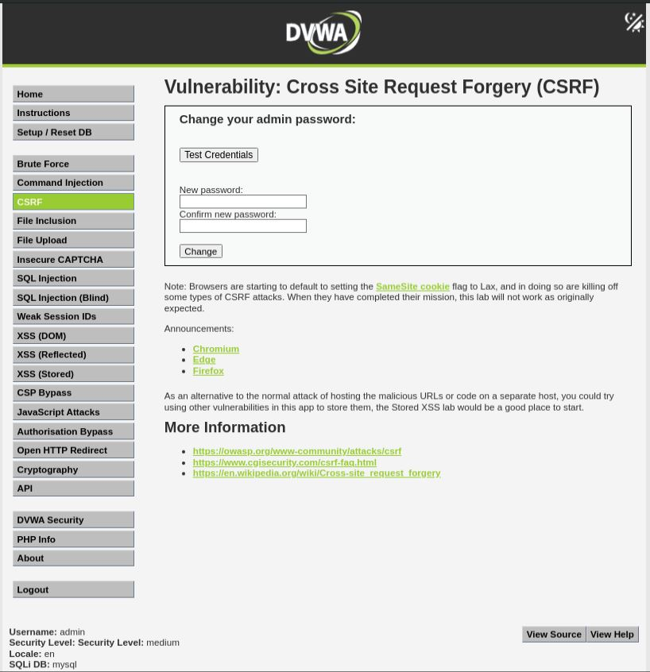
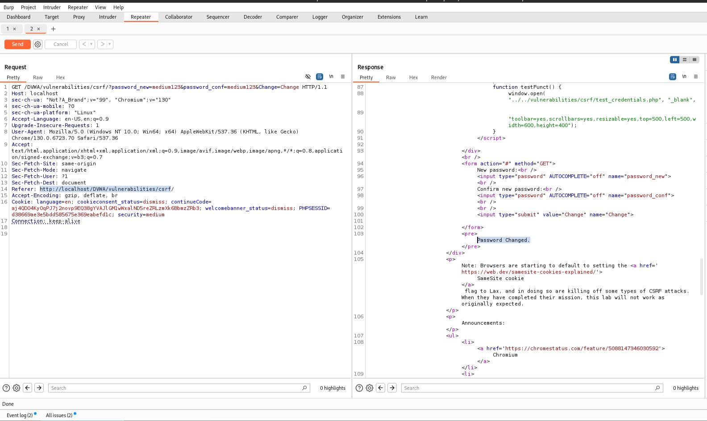

# CSRF - Medium

## Step 1

Captured the password change request using Burp Suite.

## Step 2

Sent the request to Repeater and confirmed the request works with a valid Referer header.

## Step 3

Modified the Referer header to:

```text
http://evil.com/csrf.html
```

The request was rejected.

## Step 4

Modified the Referer header to:

```text
http://evil.com/localhost/csrf.html
```

The request was accepted and the password was changed successfully.

## Result

Successfully bypassed the Medium-level CSRF protection.

## Reason

The application only checks whether the server name appears anywhere inside the Referer header. This validation can be bypassed by including the hostname inside a malicious URL.

## Fix

* Implement CSRF tokens
* Validate trusted origins correctly
* Use SameSite cookies

## Screenshots







