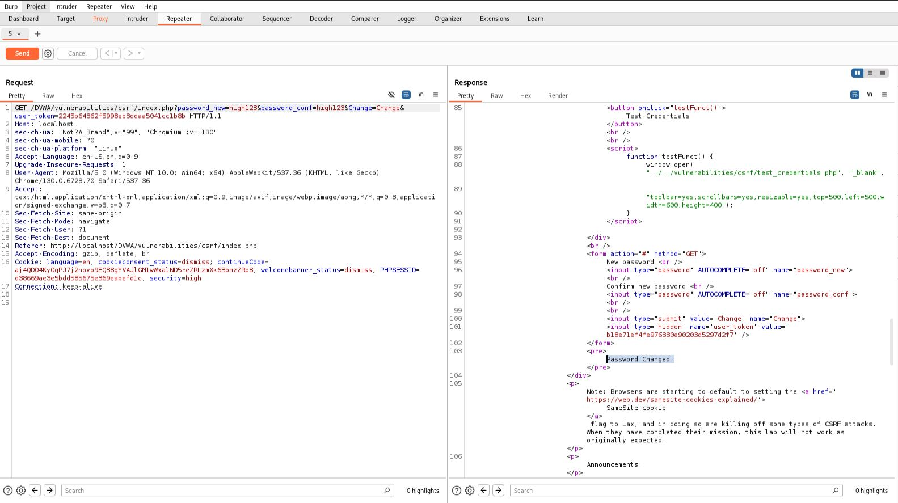

# CSRF - High

## Step 1
Opened the CSRF page with the security level set to High.

## Step 2
Captured the password change request using Burp Suite and observed the presence of a CSRF token (`user_token`).

## Step 3
Removed or modified the token and resent the request.

The application rejected the request and redirected to `index.php`.

## Step 4
Resent the request using a valid token.

The password change was processed successfully.

## Result
The CSRF attack failed when the token was missing or invalid.

## Reason
The application validates the Anti-CSRF token before processing the password change request.

## Fix
- Continue using Anti-CSRF tokens.
- Regenerate tokens securely.
- Use SameSite cookie attributes.
- Maintain server-side token validation.