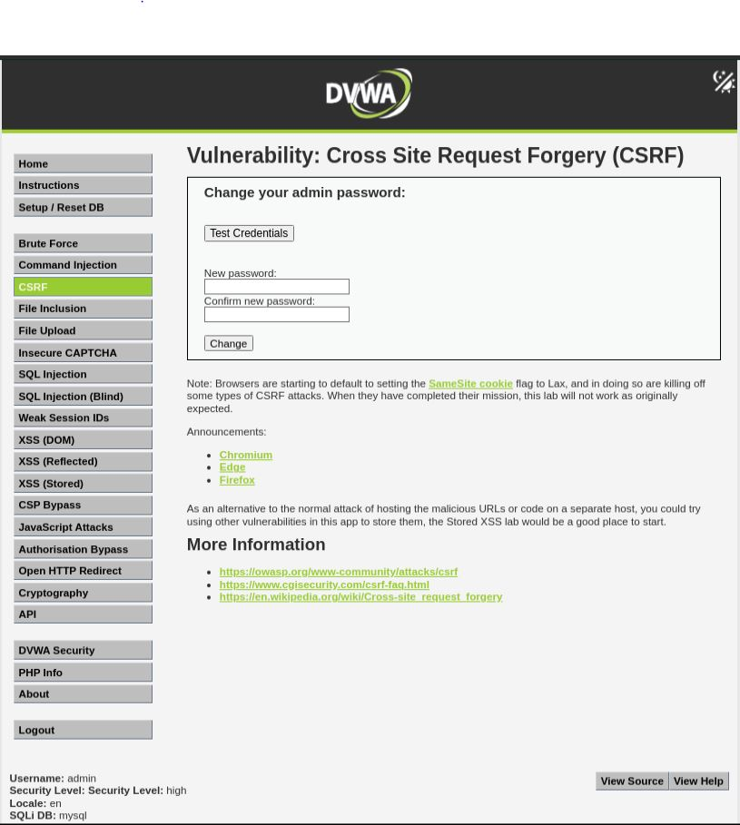
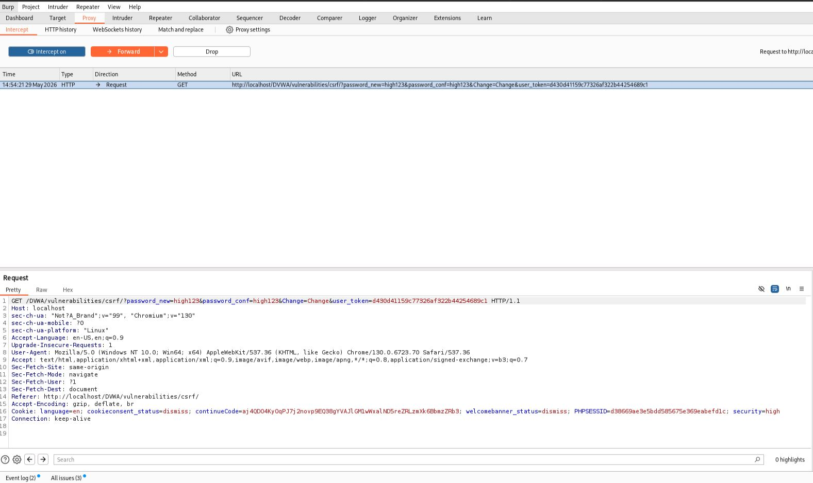
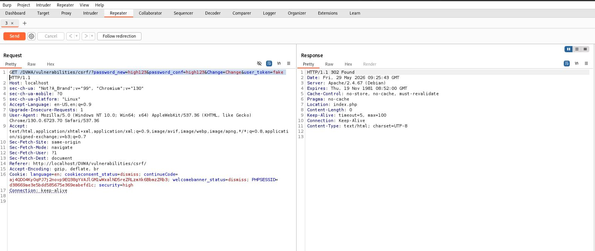

# CSRF - High

## Step 1

Opened the CSRF page with security level set to High.

## Step 2

Captured the password change request using Burp Suite.

Observed that the request contains a CSRF token (`user_token`).

## Step 3

Removed/modified the token and sent the request again.

The request failed and redirected to `index.php`.

## Step 4

Sent the request again with a valid token.

The password was changed successfully.

## Result

CSRF protection prevented the attack when the token was missing or invalid.

## Reason

The application validates the `user_token` before processing the password change request.

## Fix

* Continue using CSRF tokens
* Regenerate tokens securely
* Use SameSite cookies

## Screenshots

