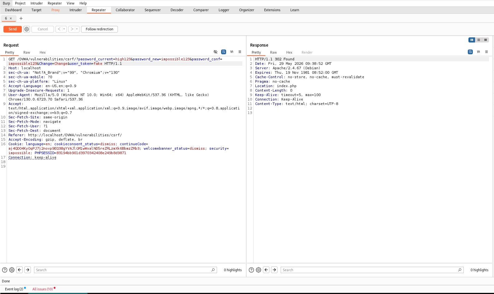

# CSRF - Impossible

## Step 1

Opened the CSRF page with security level set to Impossible.

## Step 2

Captured a legitimate password change request in Burp Suite.

Observed that the request requires both a CSRF token (`user_token`) and the current password (`password_current`).

## Step 3

Modified the request and replaced the CSRF token with an invalid value.

The request failed and the password was not changed.

## Step 4

Used a valid CSRF token but supplied an incorrect current password.

The application returned:

`Passwords did not match or current password incorrect.`

## Step 5

Sent the request using a valid CSRF token and the correct current password.

The password was changed successfully.

## Result

CSRF exploitation was not possible.

## Reason

The application validates both the Anti-CSRF token and the user's current password before allowing a password change.

## Fix

* Validate Anti-CSRF tokens
* Require current password verification
* Regenerate session tokens securely

## Screenshots

