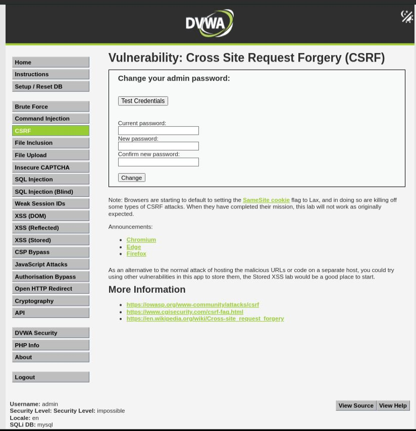
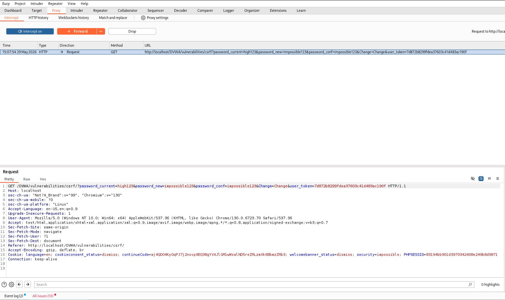
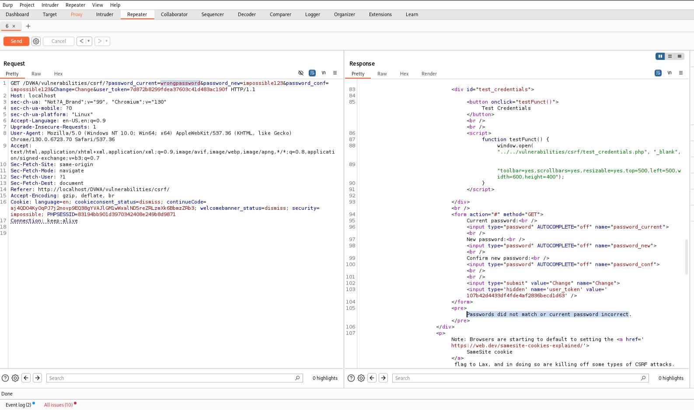
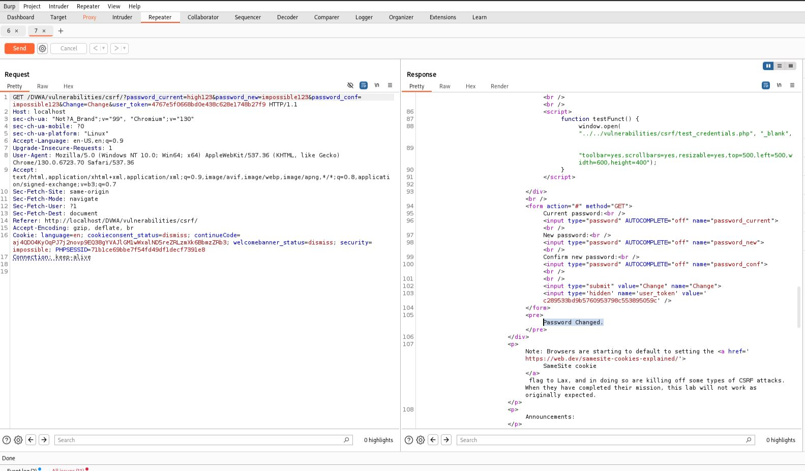

# CSRF - Impossible

## Step 1
Opened the CSRF page with the security level set to Impossible.

## Step 2
Captured a legitimate password change request using Burp Suite.

Observed that both a CSRF token (`user_token`) and the current password (`password_current`) were required.

## Step 3
Modified the request and replaced the CSRF token with an invalid value.

The request failed and the password was not changed.

## Step 4
Used a valid CSRF token but supplied an incorrect current password.

The application rejected the request.

## Step 5
Sent the request with both a valid CSRF token and the correct current password.

The password was changed successfully.

## Result
CSRF exploitation was not possible.

## Reason
The application validates both the Anti-CSRF token and the user's current password before allowing sensitive account changes.

## Fix
Already Implemented:
- Anti-CSRF token validation.
- Current password verification.
- Secure session token handling.
- Strong server-side validation.