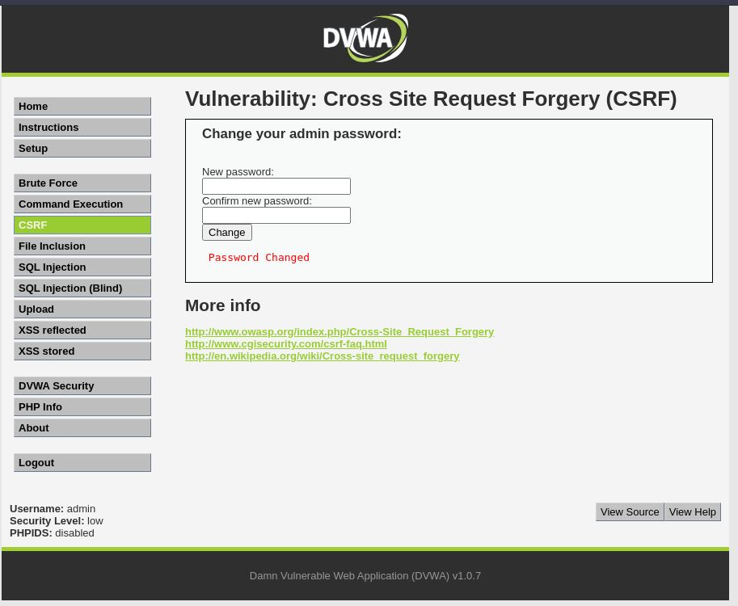
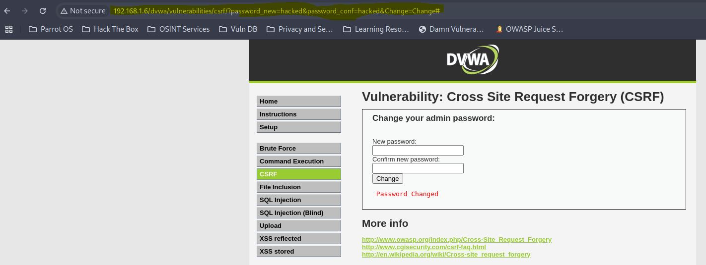

# CSRF - Low

## Step 1
Submitted password change form normally.

## Step 2
Observed that request is sent via URL parameters.

## Step 3
Recreated request manually using URL.

## Step 4
Password was changed without using the form.

## Result
Application is vulnerable to CSRF.

## Reason
No CSRF protection implemented.

## Fix
- Use CSRF tokens
- Validate requests
- Use POST instead of GET

## Screenshots

