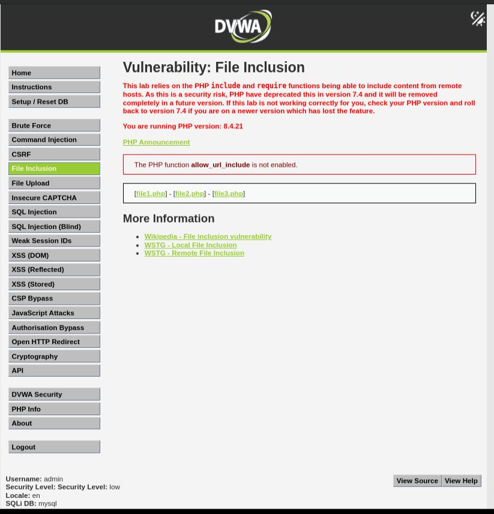
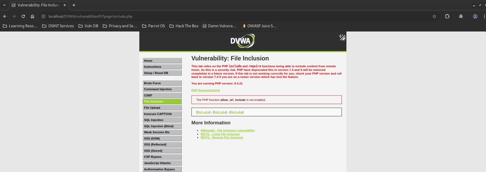
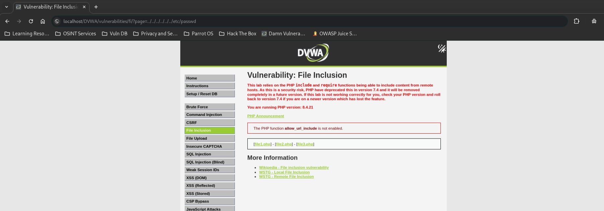
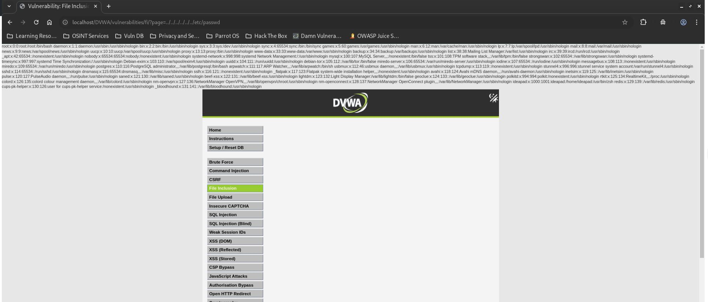

# DVWA File Inclusion - Low

## Step 1
Open the DVWA File Inclusion page and set the security level to Low.



## Step 2
Load the default page using the following parameter:

```text
?page=include.php
```



## Step 3
Modify the `page` parameter to perform Local File Inclusion.

```text
?page=../../../../../../etc/passwd
```



## Step 4
Observe that the contents of `/etc/passwd` are displayed in the browser.



## Result
Successfully accessed the contents of `/etc/passwd`, confirming a Local File Inclusion vulnerability.

## Reason
The application directly includes files based on user-controlled input without validating or restricting file paths, allowing directory traversal and arbitrary file access.

## Fix
- Use a strict allowlist of permitted files.
- Block directory traversal sequences such as `../`.
- Validate and sanitize user input.
- Use server-side file mappings instead of user-controlled paths.