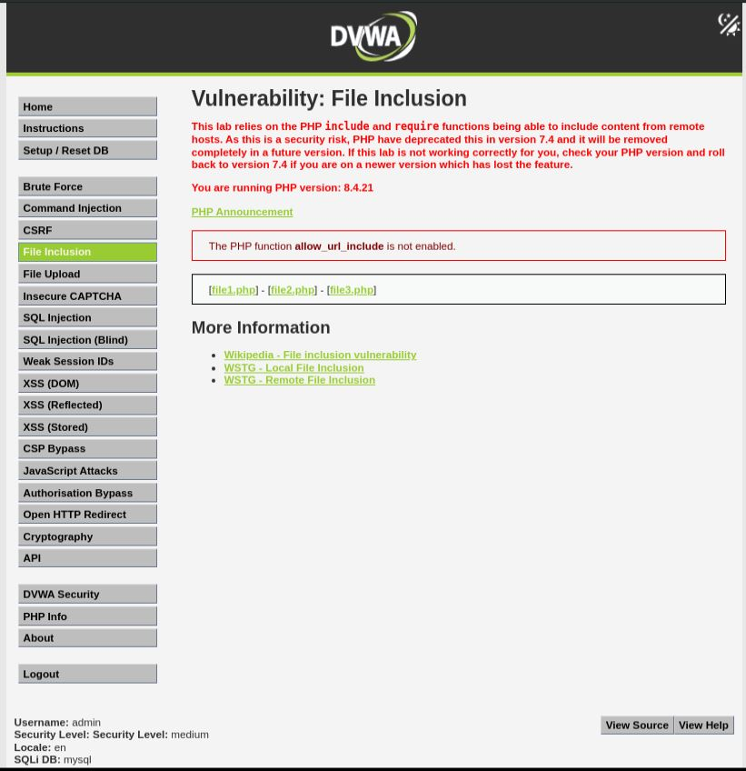
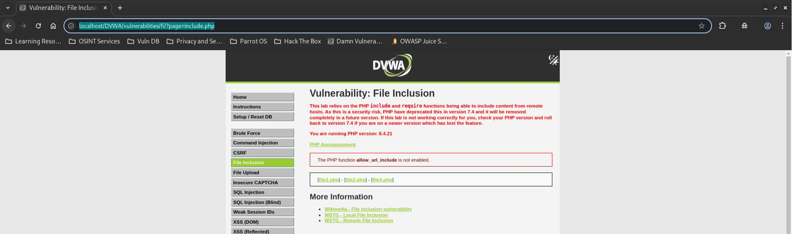
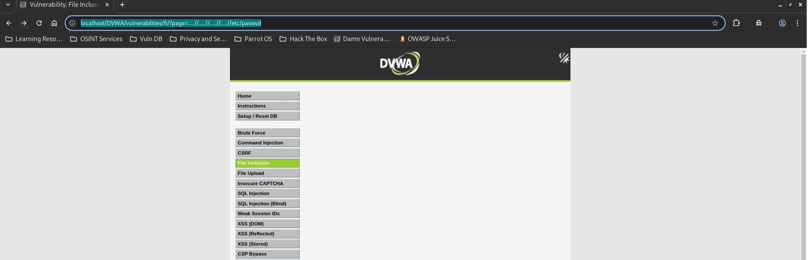
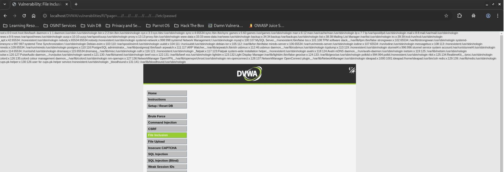

# DVWA File Inclusion - Medium

## Step 1
Open the DVWA File Inclusion page and set the security level to Medium.



## Step 2
Verify that the application loads the default page correctly.

```text
?page=include.php
```



## Step 3
Use a directory traversal bypass payload.

```text
?page=....//....//....//....//....//....//etc/passwd
```



## Step 4
Observe that the contents of `/etc/passwd` are displayed.



## Result
Successfully bypassed the application's filter and accessed a local system file.

## Reason
The application attempts to remove `../` sequences but can be bypassed using crafted payloads such as `....//`, which become valid traversal sequences after processing.

## Fix
- Do not include files directly from user input.
- Use a strict allowlist of approved files.
- Normalize file paths before validation.
- Restrict access to approved directories only.