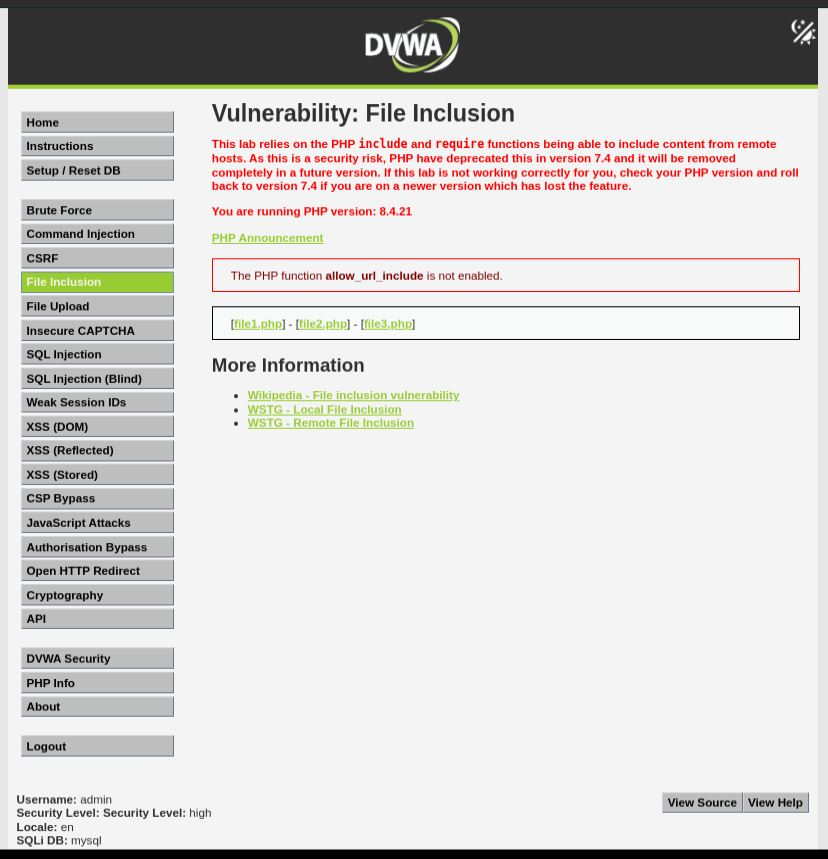
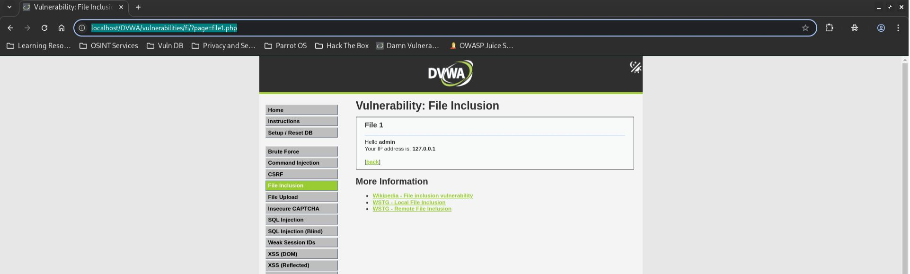
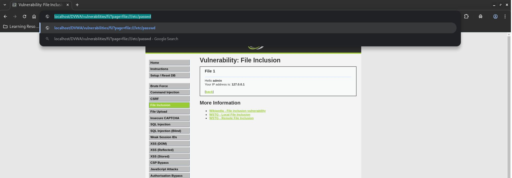
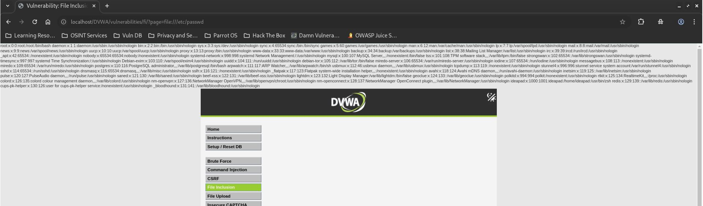

# DVWA File Inclusion - High

## Step 1
Open the DVWA File Inclusion page and set the security level to High.



## Step 2
Verify that the application loads an approved file normally.

```text
?page=file1.php
```



## Step 3
Test a file wrapper payload.

```text
?page=file:///etc/passwd
```



## Step 4
Observe that the contents of `/etc/passwd` are displayed.



## Result
Successfully exploited a Local File Inclusion vulnerability using a file wrapper payload.

## Reason
The application only checks whether the supplied value starts with `file` or matches an approved filename. The `file://` wrapper satisfies this validation and allows arbitrary local file inclusion.

## Fix
- Use a strict allowlist of approved files.
- Do not allow user-controlled file paths.
- Normalize file paths before validation.
- Disable unnecessary PHP wrappers.
- Restrict access to approved application resources.