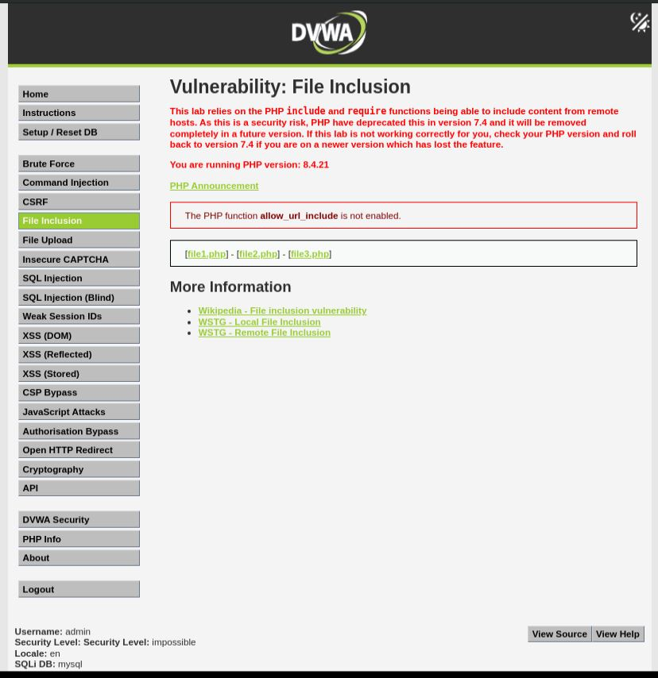
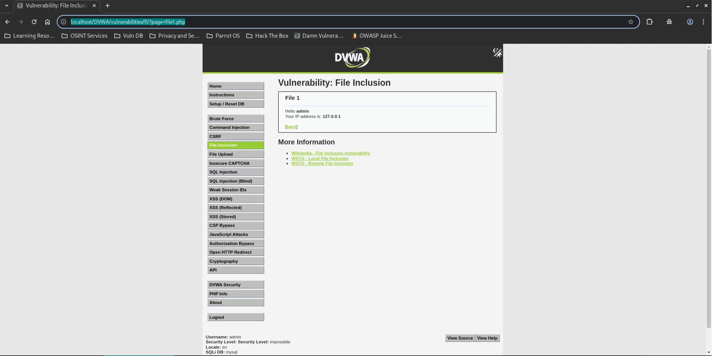
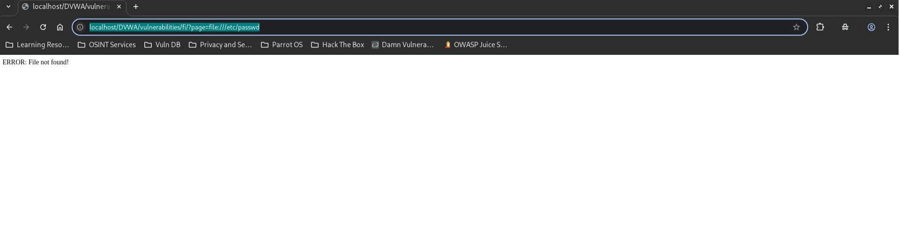
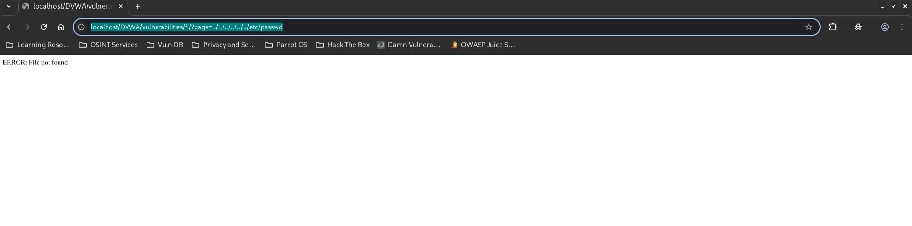

# DVWA File Inclusion - Impossible

## Step 1
Open the DVWA File Inclusion page and set the security level to Impossible.



## Step 2
Verify that an approved file loads correctly.

```text
?page=file1.php
```



## Step 3
Attempt Local File Inclusion using a file wrapper payload.

```text
?page=file:///etc/passwd
```

The application rejects the request.



## Step 4
Attempt Local File Inclusion using directory traversal.

```text
?page=../../../../../../etc/passwd
```

The application rejects the request.



## Result
The File Inclusion vulnerability could not be exploited. All unauthorized file access attempts were blocked.

## Reason
The application uses a strict allowlist and only permits approved files:

```text
include.php
file1.php
file2.php
file3.php
```

Any value outside this allowlist is rejected before file inclusion occurs.

## Fix
Already Implemented:
- Strict allowlist validation.
- Validation of all user input.
- Prevention of arbitrary file inclusion.
- Restriction of file access to approved application resources.