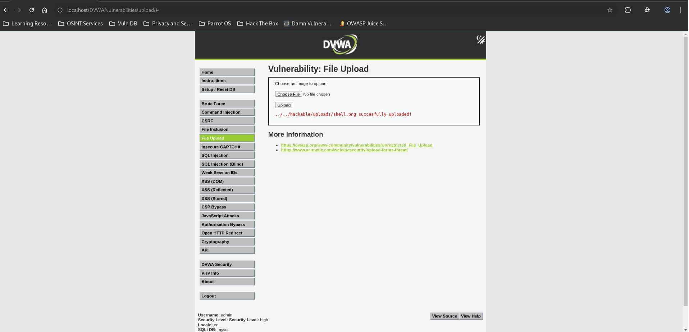
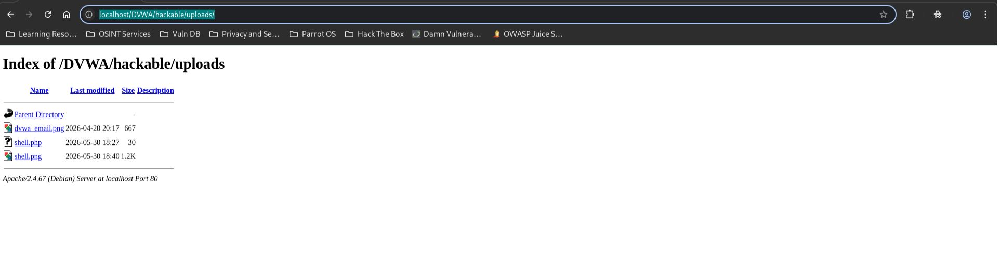

# DVWA File Upload - High

## Step 1
Create a valid PNG image containing an embedded PHP payload.

```php
<?php system($_GET['cmd']); ?>
```


## Step 2
Upload `shell.png` through the File Upload page.



## Step 3
Verify that the uploaded file appears in the upload directory.



## Result
The file was uploaded successfully despite containing a PHP payload.

## Reason
The application validates:
- File extension (`jpg`, `jpeg`, `png`)
- File size
- Image content using `getimagesize()`

Because the payload was embedded inside a valid PNG image, all validation checks passed.

## Fix
- Store uploads outside the web root.
- Re-encode uploaded images before saving.
- Remove embedded metadata and appended content.
- Disable script execution in upload directories.
- Use strict content validation and image processing libraries.