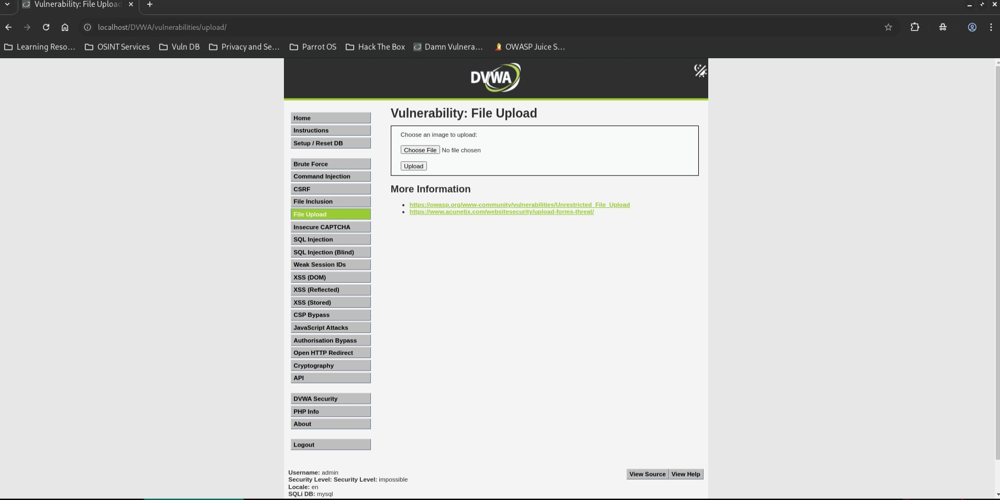
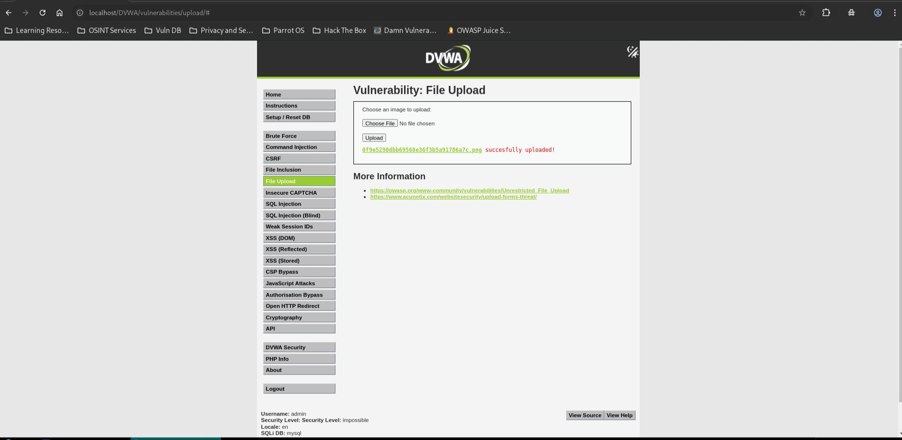
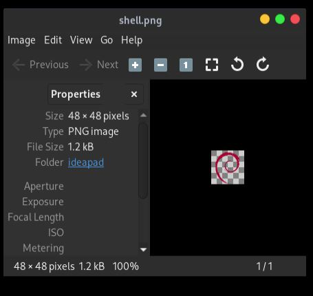

# DVWA File Upload - Impossible

## Step 1
Upload a valid PNG image containing an embedded PHP payload.

## Step 2
The application validates:
- File extension
- MIME type
- File size
- Image content using `getimagesize()`
- Anti-CSRF token

## Step 3
The uploaded image is re-encoded and renamed with a random hash before storage.

## Result
The image uploaded successfully, but the embedded PHP payload was removed during image re-encoding. No command execution was possible.

## Reason
The application rebuilds the image using server-side image processing functions and stores a newly generated image file. Any embedded PHP code is stripped during re-encoding. Randomized filenames also prevent predictable access paths.

## Fix
Already Implemented:
- CSRF protection.
- Extension validation.
- MIME type validation.
- Image verification.
- Image re-encoding.
- Randomized filenames.