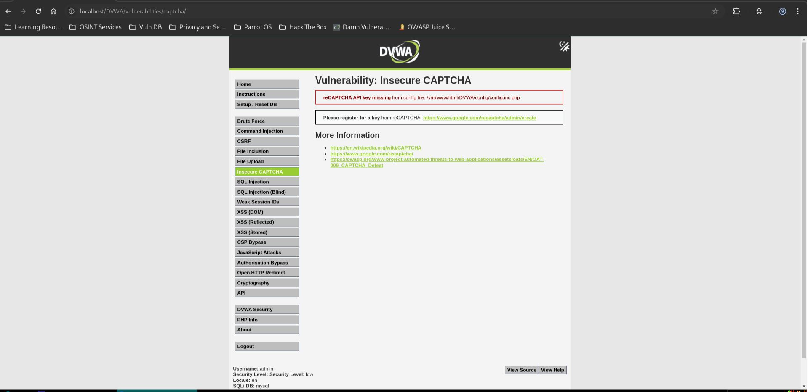
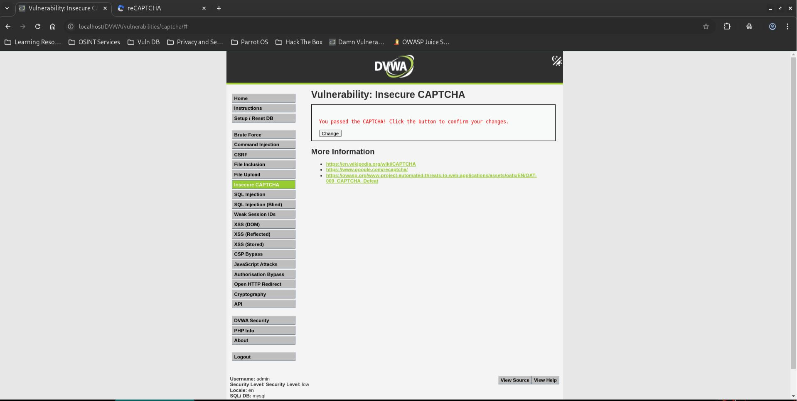
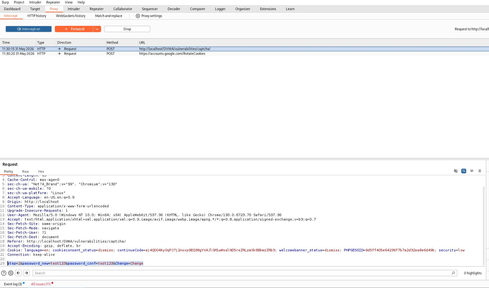
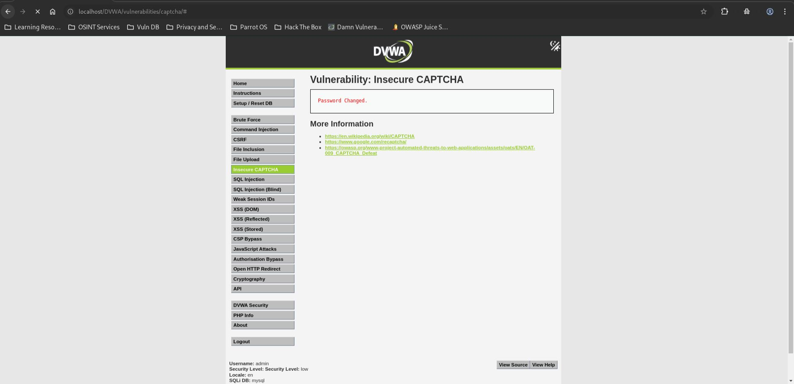

# DVWA Insecure CAPTCHA - Low Level

## Step 1
Opened the Insecure CAPTCHA page with security level set to Low.

## Step 2
Completed the CAPTCHA and reached the confirmation stage.

## Step 3
Intercepted the final request and confirmed it only used `step=2`.

## Result
The password was changed successfully.

## Reason
The CAPTCHA is checked only in step 1.  
The real password change happens in step 2 without CAPTCHA verification.

## Fix
Validate CAPTCHA on the final password change request and enforce server-side workflow checks.