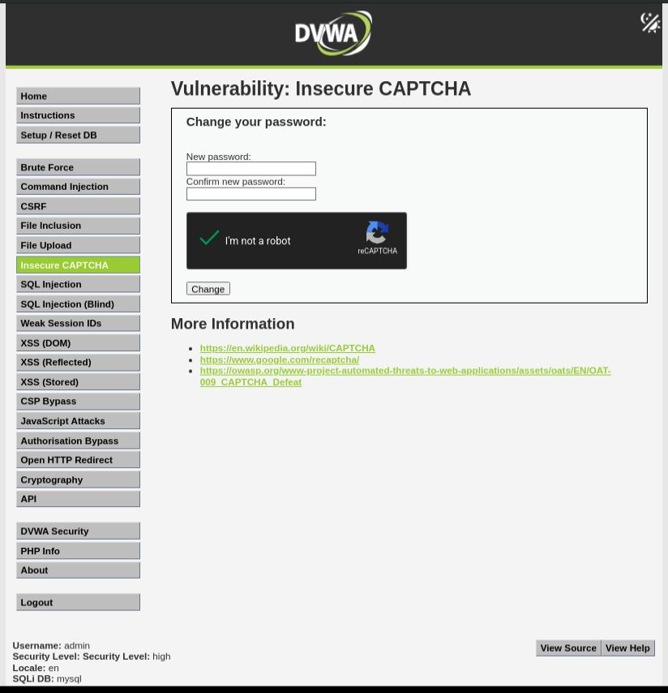
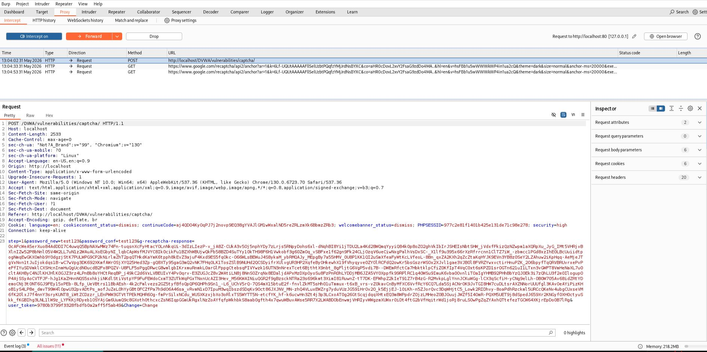
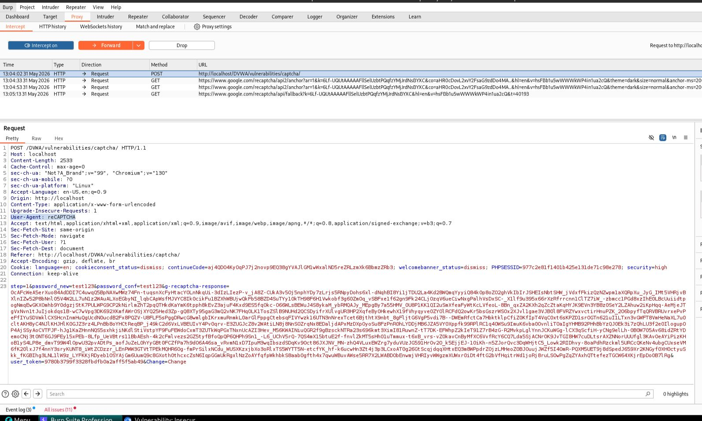
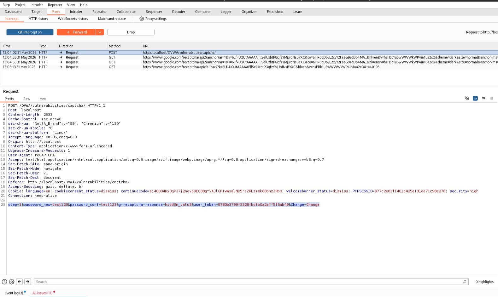
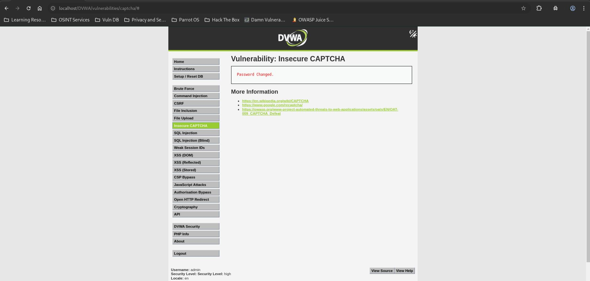

# DVWA Insecure CAPTCHA - High Level

## Step 1

Opened the Insecure CAPTCHA page with security level set to High.



## Step 2

Entered a new password and intercepted the request using Burp Suite.



## Step 3

Modified the `User-Agent` header:

```text
User-Agent: reCAPTCHA
```



## Step 4

Modified the CAPTCHA response value:

```text
g-recaptcha-response=hidd3n_valu3
```

and prepared the bypass request.



## Result

Forwarded the modified request and successfully changed the password.



## Reason

The application contains a hardcoded CAPTCHA bypass:

```php
if (
    $resp ||
    (
        $_POST['g-recaptcha-response'] == 'hidd3n_valu3'
        && $_SERVER['HTTP_USER_AGENT'] == 'reCAPTCHA'
    )
)
```

An attacker can manually set these values and bypass CAPTCHA validation without solving the challenge.

## Fix

* Remove hardcoded CAPTCHA bypass conditions.
* Validate CAPTCHA responses only through the official server-side verification process.
* Never trust client-controlled headers or special parameter values for security decisions.