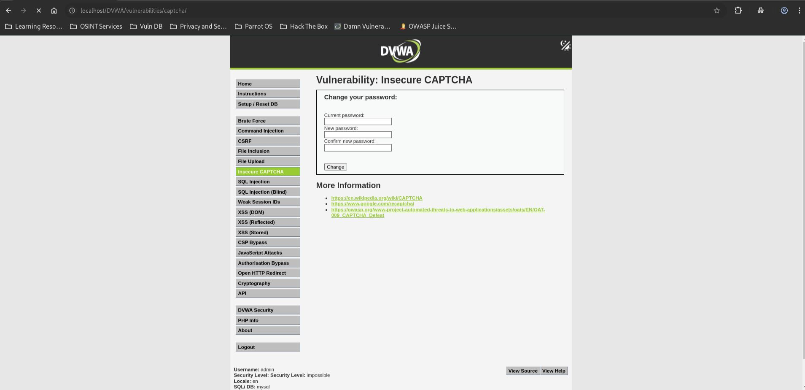
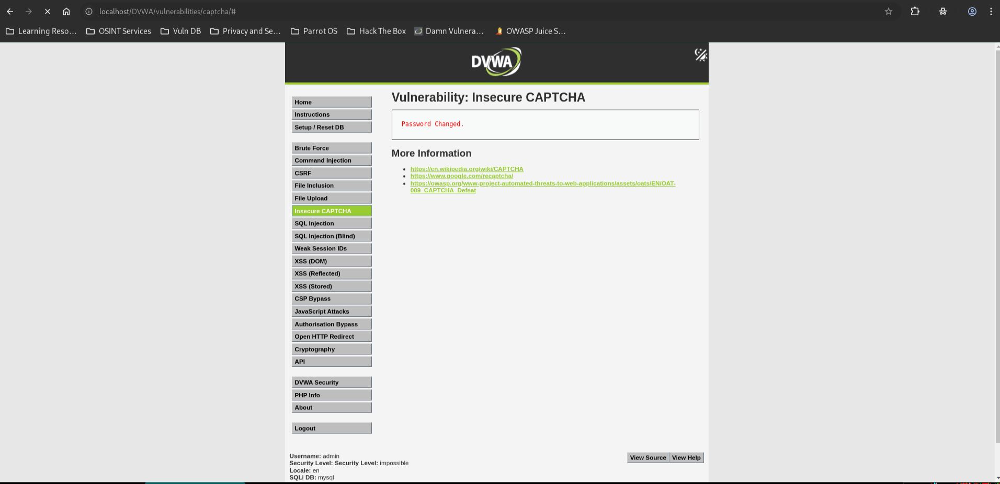

# DVWA Insecure CAPTCHA - Impossible Level

## Step 1

Opened the Insecure CAPTCHA page with security level set to Impossible.

## Step 2

Entered the correct current password, completed the CAPTCHA challenge, and successfully changed the password.

## Result

The password was changed successfully only after valid CAPTCHA verification, CSRF token validation, and current password confirmation.

## Reason

The application performs all security checks on the server side. CAPTCHA validation, CSRF protection, and password verification are properly implemented, preventing the bypass techniques that worked in the Low, Medium, and High security levels.

## Fix

No CAPTCHA bypass vulnerability was identified at the Impossible security level.