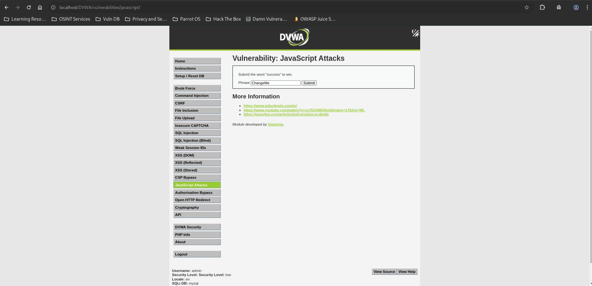
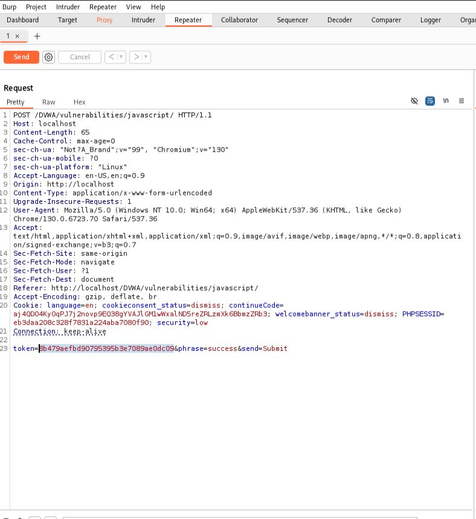
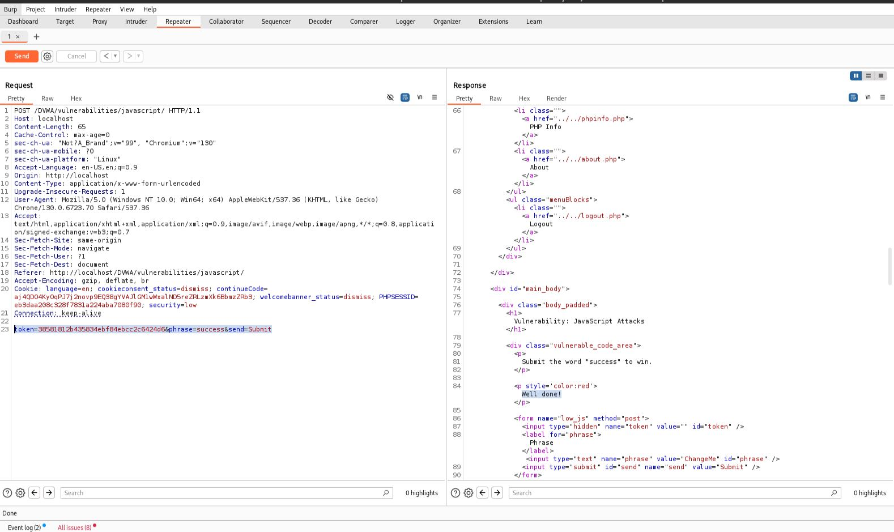

# JavaScript Attacks - Low

## Step 1

* Opened JavaScript Attacks page.
* Security level set to Low.



## Step 2

* Intercepted the request using Burp Suite.
* Identified the hidden parameters used by the application.

**Observed Request**

```text
phrase=success
token=8b479aefbd90795395b3e7089ae0dc09
```



## Step 3

* Analyzed the client-side JavaScript.
* Determined the token generation logic:

```text
MD5(ROT13(phrase))
```

* Generated the correct token for:

```text
success
```

* Modified the request and submitted it through Burp Repeater.
* Application accepted the request.



## Result

* Client-side security controls were bypassed.
* The correct token was reproduced and the challenge was successfully completed.

## Reason

* Token generation logic was exposed in client-side JavaScript.
* Security validation relied on code visible to the user.
* An attacker could reverse the algorithm and generate valid tokens.

## Fix

* Perform security validation on the server side.
* Do not rely on client-side JavaScript for access control or security decisions.
* Use server-generated cryptographically secure tokens.
* Validate tokens on the server before processing requests.
