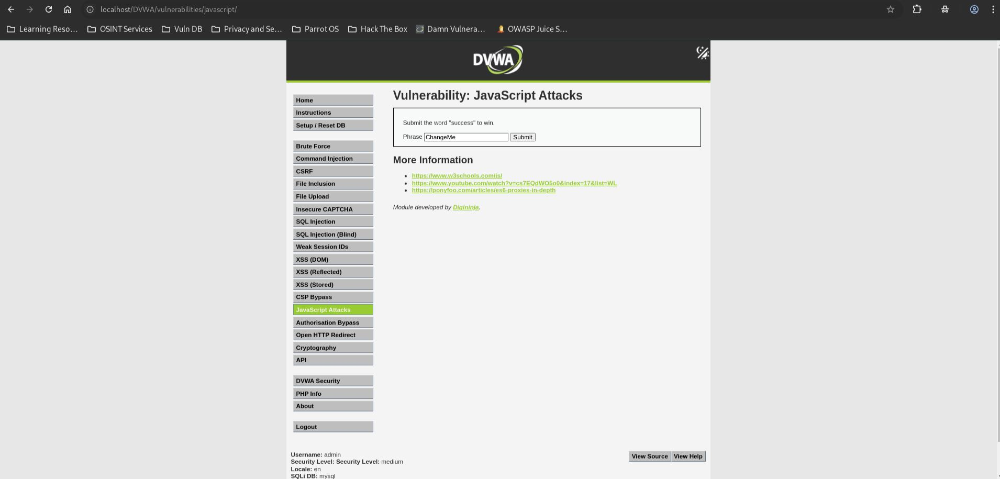
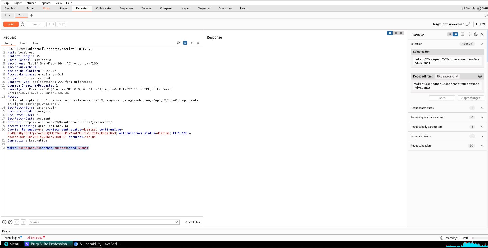
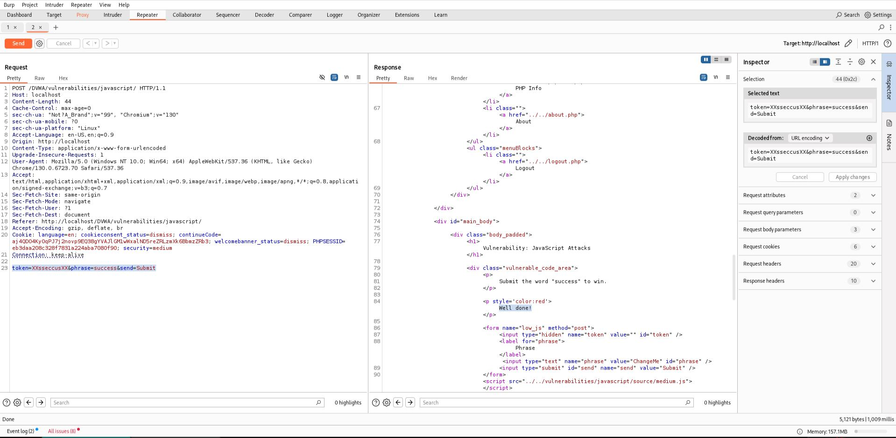

# JavaScript Attacks - Medium

## Step 1

* Opened JavaScript Attacks page.
* Security level set to Medium.



## Step 2

* Intercepted the request using Burp Suite.
* Identified the parameters used by the application.

**Observed Request**

```text
phrase=success
token=<generated_value>
```



## Step 3

* Analyzed the external JavaScript file.
* Identified the token generation logic.

**Logic**

```text
Reverse("XX" + phrase + "XX")
```

**Input**

```text
success
```

**Generated Token**

```text
XXsseccusXX
```

* Modified the token in Burp Repeater.
* Submitted the request successfully.



## Result

* Client-side validation was bypassed.
* A valid token was generated without relying on the application's JavaScript execution.

## Reason

* Token generation logic was exposed in client-side JavaScript.
* Security decisions depended on code visible to the user.
* An attacker could reverse engineer the algorithm and create valid tokens.

## Fix

* Perform validation on the server side.
* Do not rely on client-side JavaScript for security controls.
* Use server-generated cryptographically secure tokens.
* Verify all security tokens on the server before processing requests.
