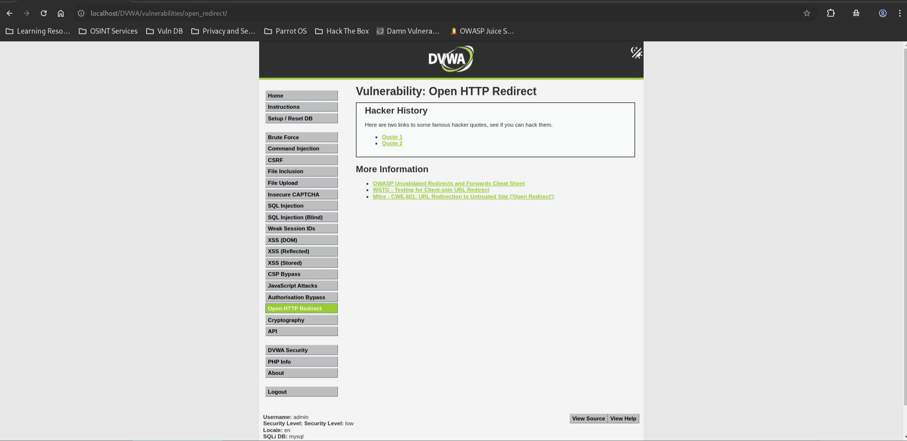
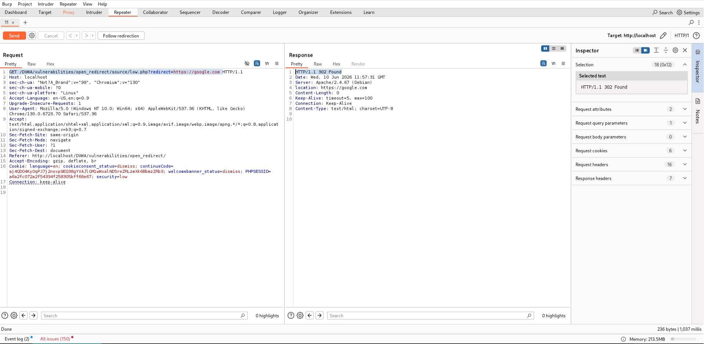

# Open HTTP Redirect - Low

## Steps

### 1. Access the Vulnerable Page

* Navigated to **DVWA → Open HTTP Redirect** with security level set to **Low**.
* Observed the available redirect links.



### 2. Intercept and Modify the Redirect Request

* Intercepted the request using **Burp Suite**.
* Modified the `redirect` parameter to an external URL:

```http
GET /DVWA/vulnerabilities/open_redirect/source/low.php?redirect=https://google.com HTTP/1.1
```

* Sent the request to the server.



## Result

The application returned:

```http
HTTP/1.1 302 Found
Location: https://google.com
```

The browser was instructed to redirect to the attacker-supplied URL.

## Reason

The application directly uses user input in the redirect operation:

```php
header("location: " . $_GET['redirect']);
```

No validation or allowlist check is performed on the destination URL.

## Fix

* Use a predefined allowlist of permitted destinations.
* Avoid accepting full URLs from user input.
* Redirect using internal route identifiers instead of user-supplied URLs.
* Validate and sanitize redirect targets before issuing redirects.
