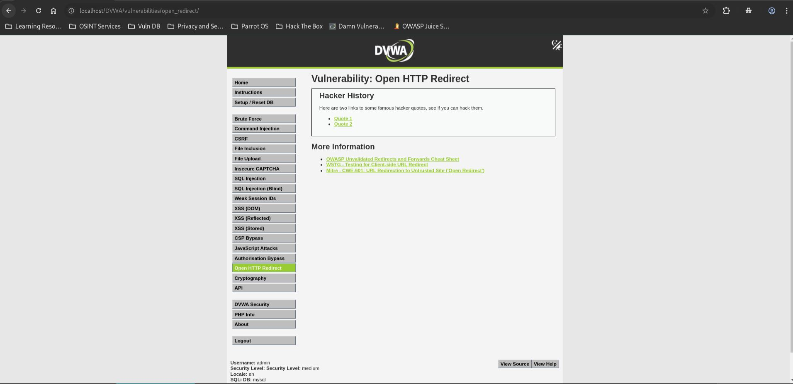
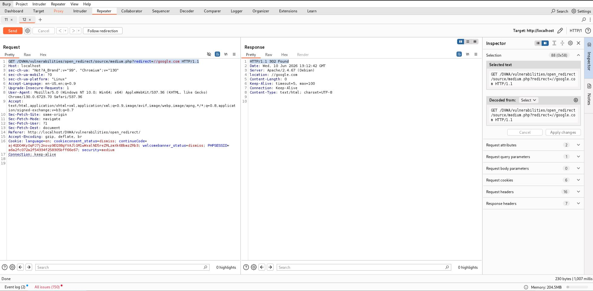

# Open HTTP Redirect - Medium

## Steps

### 1. Access the Vulnerable Page

* Navigated to **DVWA → Open HTTP Redirect** with security level set to **Medium**.



### 2. Intercept and Modify the Request

* Intercepted the request using **Burp Suite**.
* Observed that the application blocks URLs containing:

```text
http://
https://
```

* Bypassed the filter using a protocol-relative URL:

```http
GET /DVWA/vulnerabilities/open_redirect/source/medium.php?redirect=//google.com HTTP/1.1
```



## Result

The application returned:

```http
HTTP/1.1 302 Found
Location: //google.com
```

The browser interpreted the destination as an external URL and redirected the user to Google.

## Reason

The application attempts to block redirects using:

```php
preg_match("/http:\/\/|https:\/\//i", $_GET['redirect'])
```

The filter only checks for `http://` and `https://`.

Protocol-relative URLs such as:

```text
//google.com
```

do not match the regular expression and therefore bypass the protection.

## Fix

* Reject protocol-relative URLs (`//`).
* Implement an allowlist of trusted destinations.
* Use internal route identifiers instead of user-controlled URLs.
* Parse and validate redirect targets before issuing redirects.
