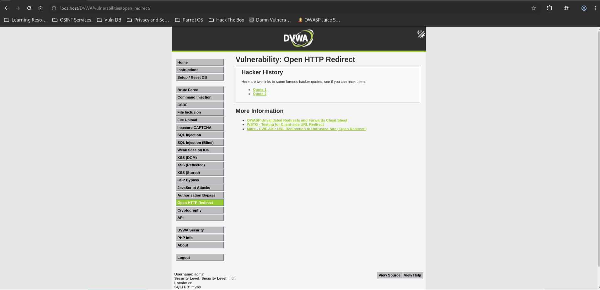
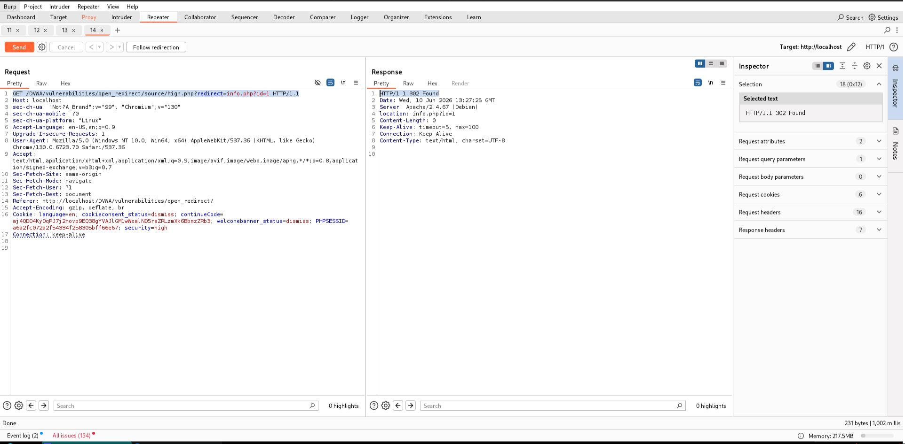

# Open HTTP Redirect - High

## Steps

### 1. Access the Vulnerable Page

* Navigated to **DVWA → Open HTTP Redirect** with security level set to **High**.
* Observed the available quote links.



### 2. Analyze the Redirect Request

* Intercepted the request generated by **Quote 1** using Burp Suite.
* Observed the application redirects using:

```http
GET /DVWA/vulnerabilities/open_redirect/source/high.php?redirect=info.php?id=1 HTTP/1.1
```

* Identified that the application only checks whether the string `info.php` exists in the supplied URL.

### 3. Bypass the Validation

* Modified the redirect parameter to an external URL containing `info.php`:

```http
GET /DVWA/vulnerabilities/open_redirect/source/high.php?redirect=https://google.com/info.php HTTP/1.1
```

* Sent the request using Burp Suite.



## Result

The application accepted the attacker-controlled URL and returned:

```http
HTTP/1.1 302 Found
Location: https://google.com/info.php
```

The browser was redirected to an external domain despite the High-level protection.

## Reason

The application validates redirects using:

```php
strpos($_GET['redirect'], "info.php") !== false
```

This check only verifies that the string `info.php` appears somewhere in the URL.

As a result, external URLs such as:

```text
https://google.com/info.php
https://attacker-site.com/info.php
```

pass validation and are accepted as redirect targets.

## Fix

* Implement a strict allowlist of approved redirect destinations.
* Validate both the hostname and path before redirecting.
* Use internal route identifiers instead of user-supplied URLs.
* Reject external URLs regardless of the presence of allowed keywords.
