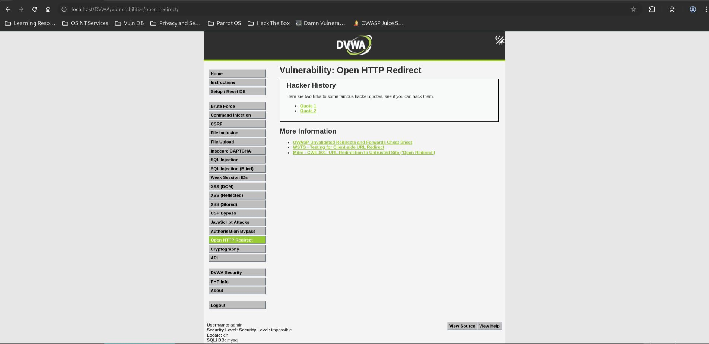

# Open HTTP Redirect - Impossible

## Steps

### 1. Access the Vulnerable Page

* Navigated to **DVWA → Open HTTP Redirect** with security level set to **Impossible**.



### 2. Attempt External Redirect Injection

* Intercepted the request using Burp Suite.
* Replaced the redirect value with an external URL:

```http
GET /DVWA/vulnerabilities/open_redirect/source/impossible.php?redirect=https://google.com HTTP/1.1
```

* Sent the request to the application.


## Result

The application returned:

```text
Missing redirect target.
```

No redirect occurred.

## Reason

The application validates the parameter using:

```php
is_numeric($_GET['redirect'])
```

Only numeric values are accepted.

The application then maps approved values to predefined destinations:

```text
1  -> info.php?id=1
2  -> info.php?id=2
99 -> https://digi.ninja
```

Users cannot directly control the destination URL.

## Fix

* Continue using server-side mapping of identifiers to destinations.
* Avoid accepting arbitrary URLs from user input.
* Restrict redirects to predefined trusted locations.
* Validate all redirect targets before issuing redirects.
