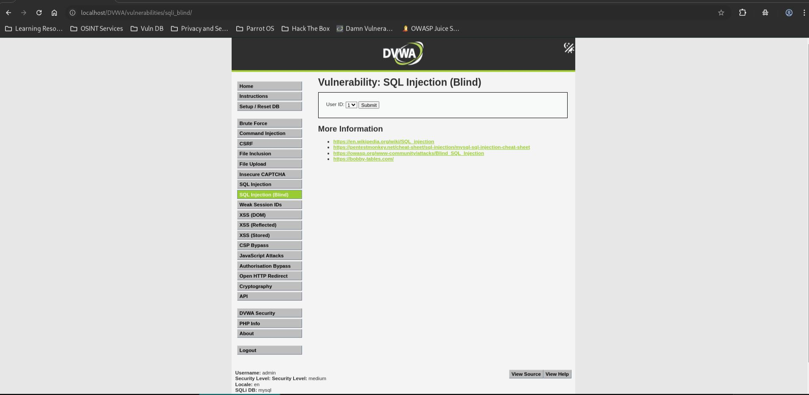
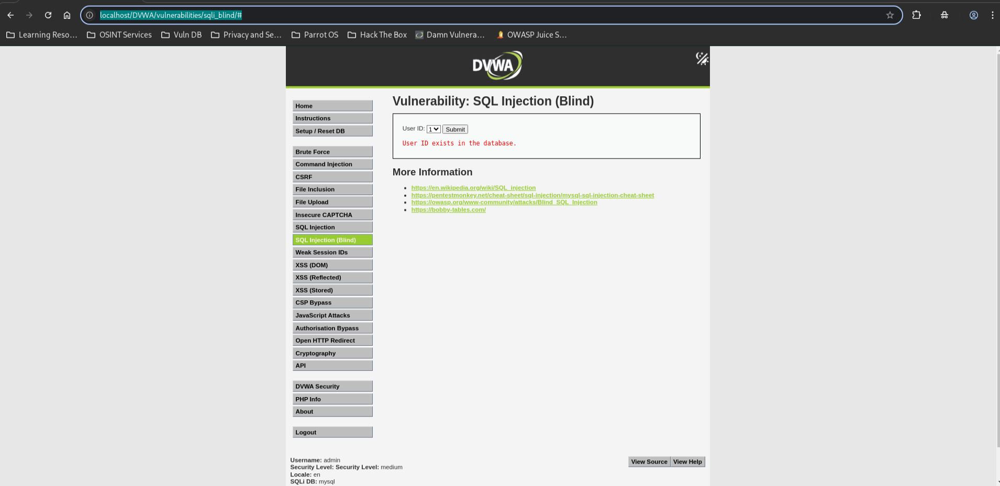
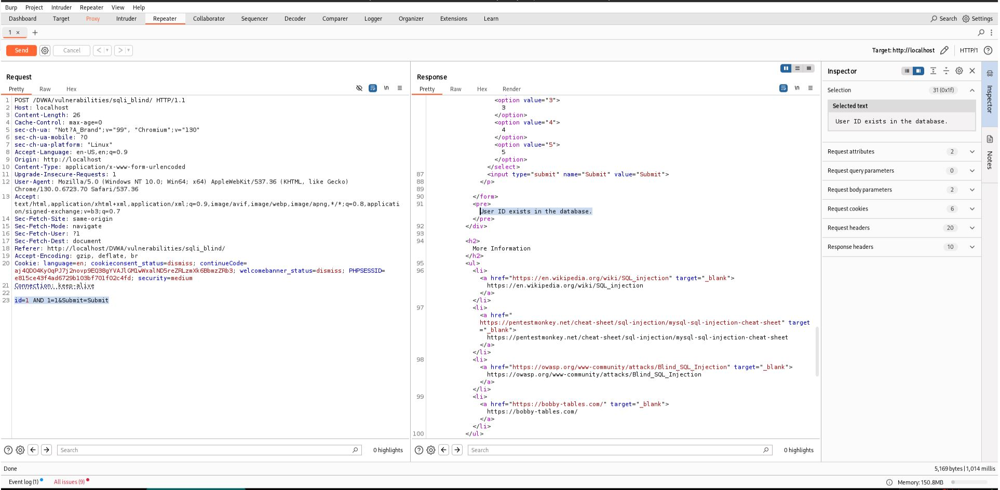
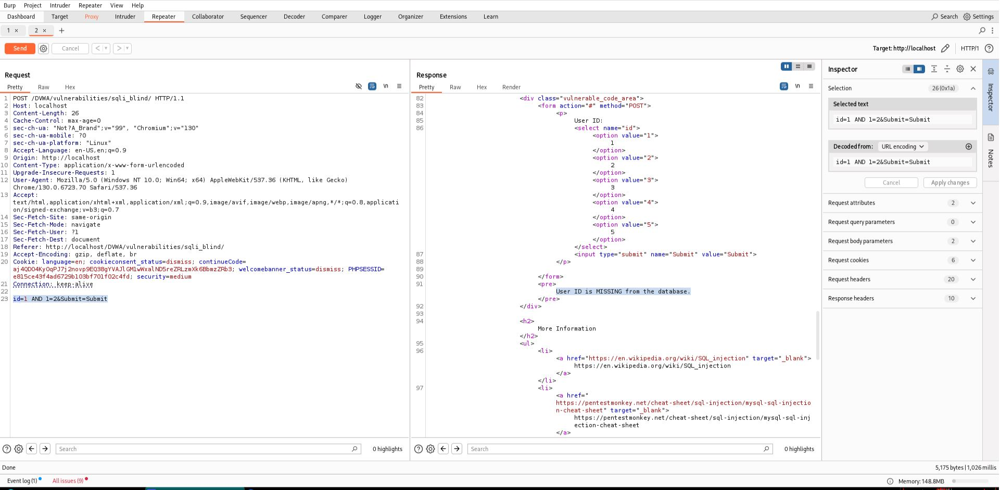

# SQL Injection (Blind) - Medium

## Step 1

* Opened SQL Injection (Blind) page.
* Security level set to Medium.



## Step 2

* Tested a valid user ID.

**Payload**

```sql
1
```

* User exists.



## Step 3

* Modified the POST parameter using Burp Suite Repeater.

**Payload**

```sql
1 AND 1=1
```

* Application returned a positive response.



## Step 4

* Modified the POST parameter using Burp Suite Repeater.

**Payload**

```sql
1 AND 1=2
```

* Application returned a negative response.



## Result

* Blind SQL Injection confirmed.
* SQL conditions could be injected through the `id` parameter.
* Application responses changed based on TRUE and FALSE conditions.

## Reason

* Input is inserted directly into the SQL query.
* `mysqli_real_escape_string()` is used, but the parameter is not enclosed in quotes and is not parameterized.
* Numeric SQL expressions can still be injected.

## Fix

* Use prepared statements with parameterized queries.
* Validate input type and enforce integer-only values.
* Implement least-privilege database permissions.
* Return generic responses that do not reveal query evaluation results.
