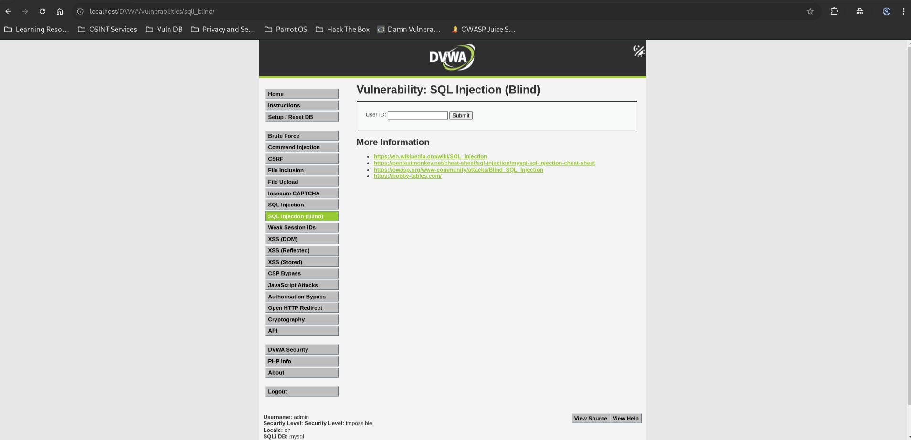
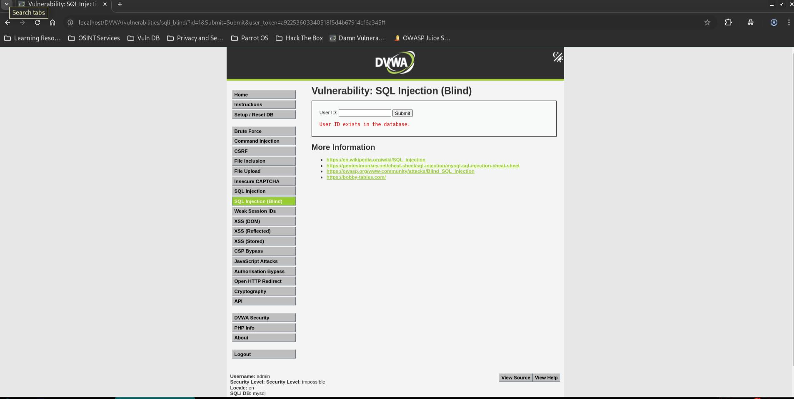
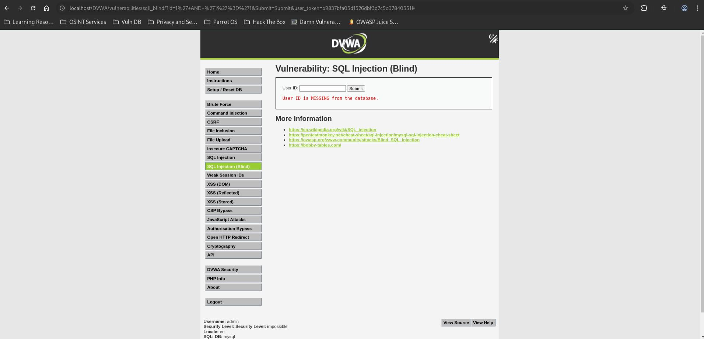

# SQL Injection (Blind) - Impossible

## Step 1

* Opened SQL Injection (Blind) page.
* Security level set to Impossible.



## Step 2

* Tested a valid user ID.

**Payload**

```sql
1
```

* Application returned a positive response.



## Step 3

* Attempted SQL Injection.

**Payload**

```sql
1' AND '1'='1
```

* Injection attempt failed.
* Application returned a negative response.



## Result

* Blind SQL Injection was not exploitable.
* Malicious SQL input was rejected and did not affect the query.

## Reason

* Input is validated using `is_numeric()`.
* Input is converted using `intval()`.
* Prepared statements with bound parameters (`PDO::PARAM_INT`) are used.
* Anti-CSRF protection is implemented.

## Fix

* Already properly mitigated.
* Continue using prepared statements and strict input validation.
* Maintain CSRF protection and least-privilege database permissions.
