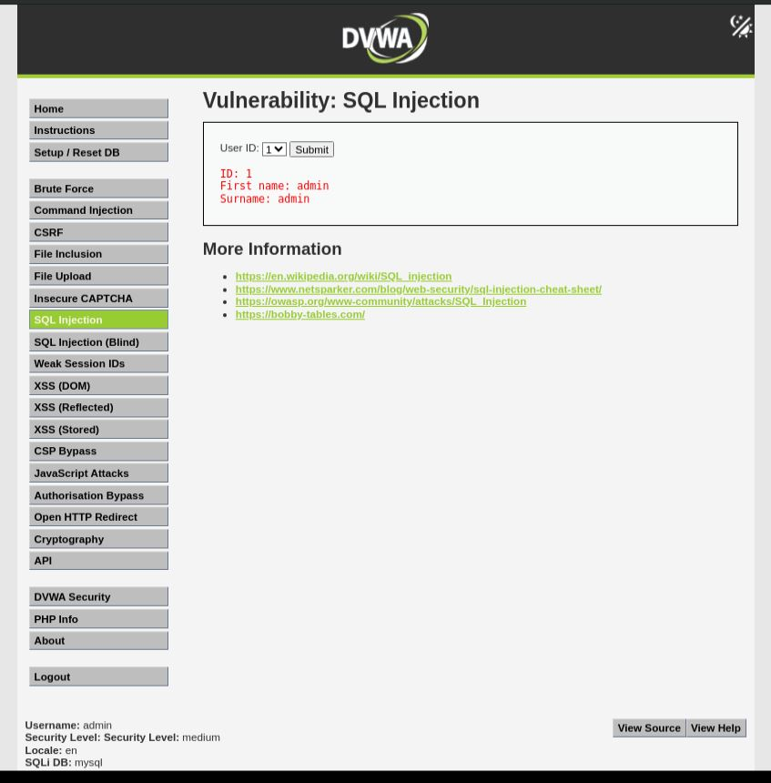
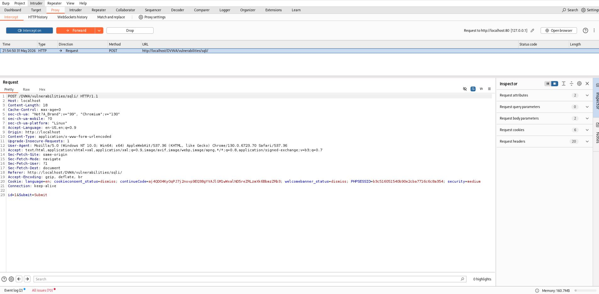
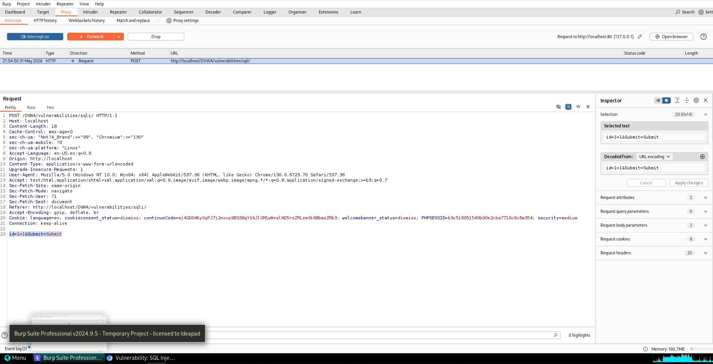
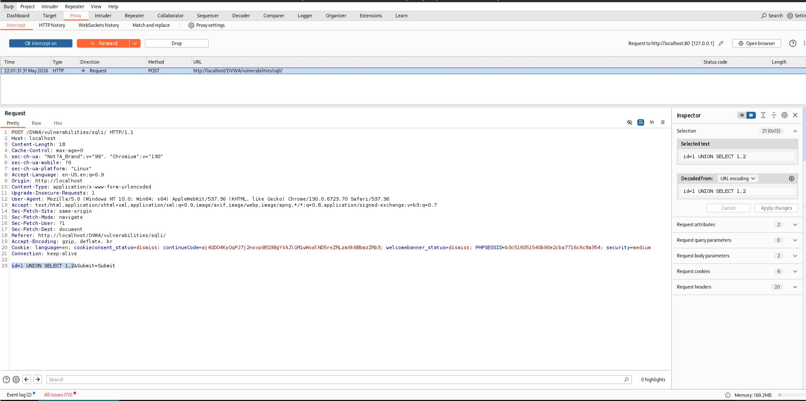
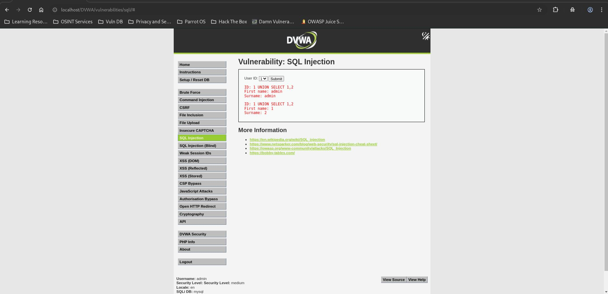

# SQL Injection – DVWA (Medium Security)

## Step 1 – Open the Target Page

* Navigated to the SQL Injection module in DVWA.
* Verified that the Security Level was set to Medium.

**Screenshot:** 01_Target_Page_Medium.jpg

---

## Step 2 – Perform a Normal Query

* Selected User ID `1`.
* Submitted the request.
* The application returned the corresponding user information.



---

## Step 3 – Intercept the Request

* Opened Burp Suite and enabled Intercept.
* Submitted the SQL Injection request.
* Captured the HTTP POST request containing the user-supplied parameter.



---

## Step 4 – Verify SQL Injection

* Modified the intercepted parameter:

  ```sql
  1 OR 1=1
  ```

* Forwarded the request.

* The application returned multiple records, confirming successful SQL Injection.



---

## Step 5 – Test UNION-Based SQL Injection

* Modified the intercepted parameter:

  ```sql
  1 UNION SELECT 1,2
  ```

* Forwarded the request.

* The values `1` and `2` appeared in the output.

* Confirmed that both columns are reflected and can be used for data extraction.



---

## Step 6 – Capture Final Exploitation Result

* Verified successful UNION-based SQL Injection.
* Confirmed that attacker-controlled data was displayed in the application response.



---

## Result

The SQL Injection vulnerability was successfully exploited at Medium security level. By intercepting and modifying the POST request, malicious SQL statements were injected into the backend query. UNION-based SQL Injection was achieved, demonstrating that database information could potentially be extracted.

---

## Reason

The application attempts to sanitize user input using:

```php
$id = mysqli_real_escape_string($GLOBALS["___mysqli_ston"], $id);
```

However, the value is directly inserted into the SQL query:

```php
$query = "SELECT first_name, last_name FROM users WHERE user_id = $id;";
```

Because the parameter is not strictly validated and is concatenated directly into the query, attackers can manipulate the SQL statement.

---

## Fix

* Use parameterized queries (Prepared Statements).
* Validate and sanitize all user input.
* Enforce strict numeric validation for ID parameters.
* Avoid dynamic SQL query construction.
* Apply the principle of least privilege to database accounts.
* Conduct regular security testing and code reviews.
