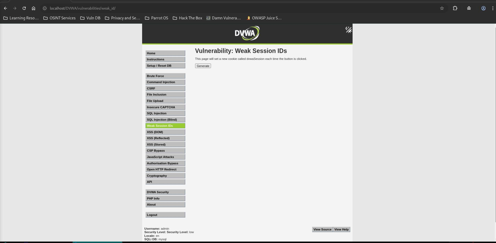
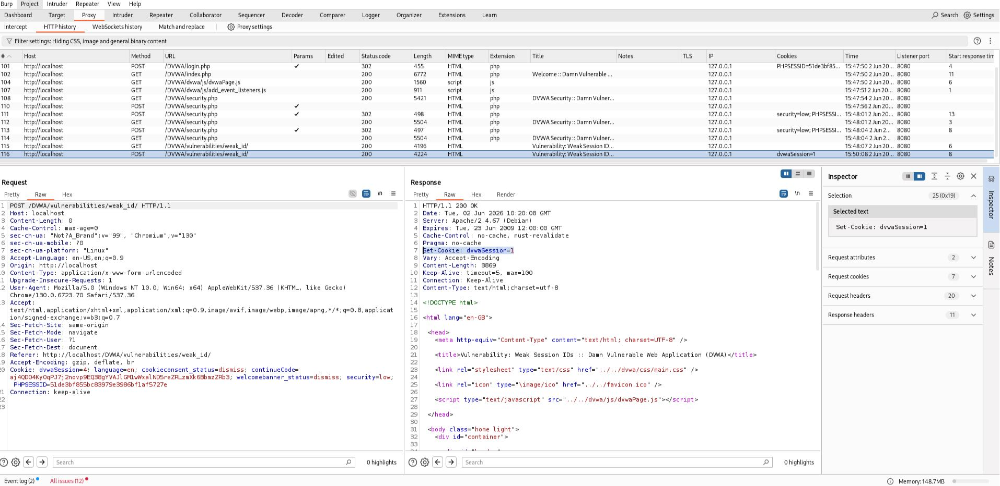
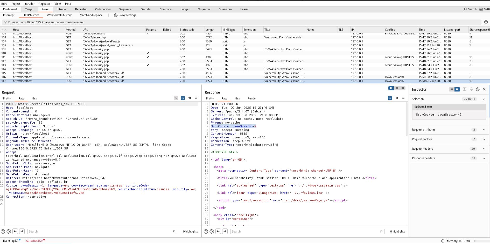
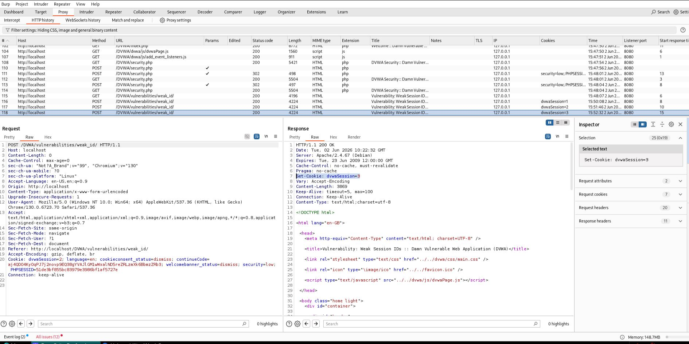

# Weak Session IDs - Low

## Step 1

* Opened Weak Session IDs page.
* Security level set to Low.



## Step 2

* Generated a session ID.
* Observed the cookie value.

**Value**

```text
dvwaSession=1
```



## Step 3

* Generated another session ID.
* Observed the cookie value increment.

**Value**

```text
dvwaSession=2
```



## Step 4

* Generated a third session ID.
* Observed the cookie value increment.

**Value**

```text
dvwaSession=3
```



## Step 5

* Predicted the next session ID before generating it.
* Prediction was successful.

**Predicted Value**

```text
dvwaSession=4
```

**Screenshot:** `05_predicted_session_id.jpg`

## Result

* Session IDs were predictable.
* Future session IDs could be accurately guessed.

## Reason

* Session IDs are generated sequentially.
* The application increments the value by one for each request.
* No randomness is used in session generation.

## Fix

* Use cryptographically secure random session IDs.
* Regenerate session IDs after authentication.
* Avoid predictable or sequential session values.
* Use secure session management mechanisms provided by the framework.
